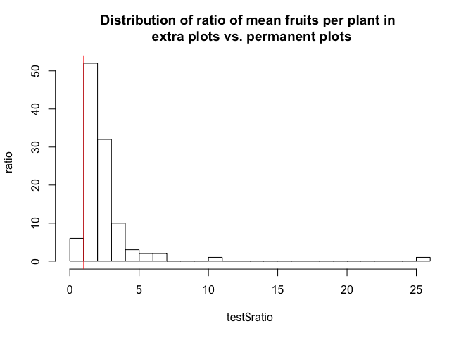
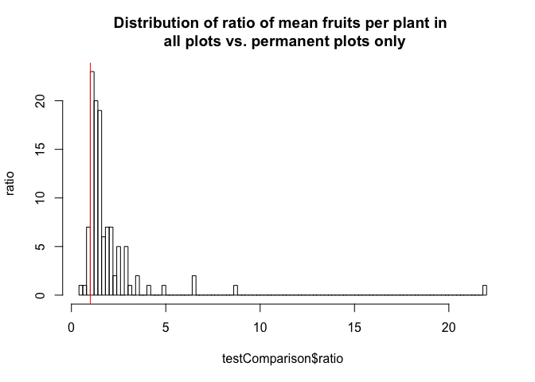

### Data processing workflow

I’m trying to document the data processing workflow. I am using the
packages `tidyverse` and `readxl` (documentation:
<https://readxl.tidyverse.org/>). Link to the Issue documentation for
the data processing workflow:
<https://github.com/gregor-fausto/clarkiaSeedBanks/issues/6>.

  - [File directories](#file-directories)
  - [Processing data](#processing-data)
  - [Seeds per fruit data](#seeds-per-fruit-data)
  - [Fruits per plant data for
    transects](#fruits-per-plant-data-for-transects)
  - [Fruits per plant data extra
    plots](#fruits-per-plant-data-extra-plots)
  - [Seedlings and fruiting plant
    data](#seedlings-and-fruiting-plant-data)
  - [Seed bag data](#seed-bag-data)
  - [Viability trial data](#viability-trial-data)

### File directories

The files holding datasets are originally found in the shared Dropbox
folder `.../Dropbox/Clarkia-LTREB/20_demography_sites/`. I created a
folder on my local Dropbox `/Users/Gregor/Dropbox/dataLibrary/` to hold
a copy of these files. To copy the files, I run the following in my
Terminal:

`cp /Users/Gregor/Dropbox/Clarkia-LTREB/20_demography_sites/*
/Users/Gregor/Dropbox/dataLibrary/Clarkia-LTREB/20_demography_sites/`

I also ran:

`cp /Users/Gregor/Dropbox/Clarkia-LTREB/20_demography_sites/new\ fruit\
\&\ seed\ files/*
/Users/Gregor/Dropbox/dataLibrary/Clarkia-LTREB/20_demography_sites/new\
fruit\ \&\ seed\ files/`

I last ran these on 04/15/20 at 5:20 PM. The files in this directory are
now a copy of those in the shared Dropbox folder. For the time being,
the copy of the files remains outside of the folder that gets updated on
Git.

An additional folder holding datasets is originally found in the shared
Dropbox folder `.../Dropbox/Clarkia-LTREB/data and scripts/files from
monica/`. I created a folder on my local Dropbox
`/Users/Gregor/Dropbox/dataLibrary/` to hold a copy of these files. To
copy the files, I run the following in my Terminal:

`cp /Users/Gregor/Dropbox/Clarkia-LTREB/data\ and\ scripts/files\ from\
monica/* /Users/Gregor/Dropbox/dataLibrary/Clarkia-LTREB/data\ and\
scripts/files\ from\ monica/`

I last ran this on 02/06/20 at 10:50 AM. The files in this directory are
now a copy of those in the shared Dropbox folder. For the time being,
the copy of the files remains outside of the folder that gets updated on
Git.

Additional changes:

  - in
    `/Users/Gregor/Dropbox/dataLibrary/Clarkia-LTREB/20_demography_sites/new
    fruit & seed files/fruit&seeds_2018.xlsx`, on the first sheet, I
    deleted cell V141 because it seemed that this was a formula (an
    average) rather than including raw data.
  - in
    `/Users/Gregor/Dropbox/dataLibrary/Clarkia-LTREB/20_demography_sites/new
    fruit & seed files/fruit&seeds_2014.xlsx` I changed cell Q254 from
    `0q` to `0`

Additional changes:

  - saved
    `/Users/Gregor/Dropbox/dataLibrary/Clarkia-LTREB/20_demography_sites/seeds_2011.xls`
    as
    `/Users/Gregor/Dropbox/dataLibrary/Clarkia-LTREB/20_demography_sites/seeds_2011.xlsx`

  - saved
    `/Users/Gregor/Dropbox/dataLibrary/Clarkia-LTREB/20_demography_sites/seeds_2012.xls`
    as
    `/Users/Gregor/Dropbox/dataLibrary/Clarkia-LTREB/20_demography_sites/seeds_2012.xlsx`

  - deleted empty rows at the bottom of the file
    `/Users/Gregor/Dropbox/dataLibrary/Clarkia-LTREB/20_demography_sites/seeds_2012.xlsx`;
    these are filled with some formatting and otherwise may give
    problems with data importing

  - saved
    `/Users/Gregor/Dropbox/dataLibrary/Clarkia-LTREB/20_demography_sites/seeds_2013.xls`
    as
    `/Users/Gregor/Dropbox/dataLibrary/Clarkia-LTREB/20_demography_sites/seeds_2013.xlsx`

  - deleted empty rows at the bottom of the file
    `/Users/Gregor/Dropbox/dataLibrary/Clarkia-LTREB/20_demography_sites/seeds_2013.xlsx`;
    these are filled with some formatting and otherwise may give
    problems with data importing

  - saved
    `/Users/Gregor/Dropbox/dataLibrary/Clarkia-LTREB/20_demography_sites/seeds_2014.xls`
    as
    `/Users/Gregor/Dropbox/dataLibrary/Clarkia-LTREB/20_demography_sites/seeds_2014.xlsx`

  - deleted empty rows at the bottom of the file
    `/Users/Gregor/Dropbox/dataLibrary/Clarkia-LTREB/20_demography_sites/seeds_2014.xlsx`,
    sheet 2; these are filled with some formatting and otherwise may
    give problems with data importing

  - saved
    `/Users/Gregor/Dropbox/dataLibrary/Clarkia-LTREB/20_demography_sites/seeds_2015.xls`
    as
    `/Users/Gregor/Dropbox/dataLibrary/Clarkia-LTREB/20_demography_sites/seeds_2015.xlsx`

### Processing data

Load the libraries for data processing (see
<https://github.com/r-lib/rlang/issues/669> for the overwrite message I
am suppressing)

``` r
library(tidyverse)
library(readxl)
library(knitr)
library(lubridate)
library(tidyxl)
```

Scripts for the original processing I did is located in the following
folder. I want to document when I last updated these files before I
start updating the workflow. None of the original scripts are going to
be changed.

``` r
dir = c("/Users/Gregor/Dropbox/projects/clarkiaScripts/code/reshapeDataScripts/")
files = list.files(path=dir)
dt <- data.frame(files)
fileModified <- function(x){file.info(paste0(dir,x))$mtime}

for(i in 1:dim(dt)[1]){
  dt[i,2] <- ymd_hms(fileModified(files[i])) %>%
    data.frame() %>% rename(dateTime='.') 
}

kable(dt)
```

| files                                 | dateTime            |
| :------------------------------------ | :------------------ |
| Estimation of Clarkia vital rates.doc | 2018-08-05 10:03:31 |
| germ\_and\_viability.xls              | 2016-10-24 09:59:32 |
| germ\&viability.xls                   | 2016-10-24 09:59:32 |
| reshapeAllClimate.R                   | 2017-11-07 10:39:30 |
| reshapeFruitAndSeedData.R             | 2017-12-18 14:09:52 |
| reshapeFruits.R                       | 2016-12-23 19:53:00 |
| reshapeFruitsPerPlantFromPlots.R      | 2016-10-18 08:55:23 |
| reshapeMasterFile.R                   | 2016-02-02 17:33:17 |
| reshapeSeedBags-VersionThree.R        | 2018-08-01 19:01:20 |
| reshapeSeedBags-VersionTwo.R          | 2017-02-14 13:57:21 |
| reshapeSeedBags.R                     | 2017-02-03 09:50:15 |
| reshapeSeedBagsToSeedPots.R           | 2017-11-07 11:31:11 |
| reshapeSeedPots.R                     | 2017-11-03 14:44:45 |
| reshapeSeeds.R                        | 2016-12-23 19:52:24 |
| reshapeSiteVariables.R                | 2017-12-08 14:23:44 |
| reshapeSurvivalFecundity.R            | 2016-10-18 08:56:25 |

### Seeds per fruit data

Start with the seed data. This is file `.../reshapeSeeds.R` file in the
list above.

``` r
directory = "/Users/Gregor/Dropbox/dataLibrary/Clarkia-LTREB/20_demography_sites/new fruit & seed files/"
```

The data files for 2006-2010 have two columns. The data files include 1
sheet with the following data: 1 column for the site at which the
undamaged fruit was collected, and 1 column for the number of seeds in
the undamaged fruit.

``` r
# all years in the dataset
years <- 2006:2018

# all sheets that contain this data
sheetVector <- c("06 Raw Data","07 Raw Data","08 Raw Data",
                 "09 Raw Data","10 Raw Data","11 Raw Data",
                 "12 Raw Data","13 Raw Data","14 Raw Data",
                 "15 Raw Data","16 Raw Data","17 Raw Data",
                 "18 Raw Data")

# range of data in each sheet
rangeVector <- c("Q5:V828","Q6:V1277","Q4:V1188",
                 "P4:U1214","Q5:V1248","Q8:V1051",
                 "Q7:V654","R12:W988","R10:W1110",
                 "R10:W1077","S10:X1532","R9:W1667",
                 "R12:W1311")

# empty list
dataList <- list()

# loop for getting each data range into a list of data frames
for(i in 1:length(sheetVector)){
  dataList[[i]] <- read_excel(
    paste0(directory,"Above_ground survival & fecundity 06-19.xlsx"),
    sheet = sheetVector[i], 
    range = rangeVector[i],
    na = "NA")
}

# rename variable to be consistent with other datasets
names(dataList[[3]])[6] <- "demography?"

# add year to the data frames
for(i in 1:length(years)){
  dataList[[i]] <- dataList[[i]] %>%
      dplyr::mutate(year=years[i])
}

# join all data frames
countSeedPerFruit <- dataList %>%
  purrr::reduce(full_join)
```

    ## Joining, by = c("Site_No", "SITE", "Full_Site_Name", "Sdno", "damaged?", "demography?", "year")
    ## Joining, by = c("Site_No", "SITE", "Full_Site_Name", "Sdno", "damaged?", "demography?", "year")
    ## Joining, by = c("Site_No", "SITE", "Full_Site_Name", "Sdno", "damaged?", "demography?", "year")
    ## Joining, by = c("Site_No", "SITE", "Full_Site_Name", "Sdno", "damaged?", "demography?", "year")
    ## Joining, by = c("Site_No", "SITE", "Full_Site_Name", "Sdno", "damaged?", "demography?", "year")
    ## Joining, by = c("Site_No", "SITE", "Full_Site_Name", "Sdno", "damaged?", "demography?", "year")
    ## Joining, by = c("Site_No", "SITE", "Full_Site_Name", "Sdno", "damaged?", "demography?", "year")
    ## Joining, by = c("Site_No", "SITE", "Full_Site_Name", "Sdno", "damaged?", "demography?", "year")
    ## Joining, by = c("Site_No", "SITE", "Full_Site_Name", "Sdno", "damaged?", "demography?", "year")
    ## Joining, by = c("Site_No", "SITE", "Full_Site_Name", "Sdno", "damaged?", "demography?", "year")
    ## Joining, by = c("Site_No", "SITE", "Full_Site_Name", "Sdno", "damaged?", "demography?", "year")
    ## Joining, by = c("Site_No", "SITE", "Full_Site_Name", "Sdno", "damaged?", "demography?", "year")

``` r
# clean up variable names and use lower camelcase for variable names
countSeedPerFruit <- countSeedPerFruit %>% 
  janitor::clean_names(case="lower_camel")

# save the dataframe as an RDS file
write_rds(countSeedPerFruit,"~/Dropbox/dataLibrary/postProcessingData/countSeedPerFruit.RDS")

# this is now missing the permanent plot binary columns - why?
```

The data files for 2011-2012 have four columns: (1) a column for the
site at which the undamaged fruit was collected, (2) a column for the
number of seeds in the undamaged fruit, and (3) a column indicating
whether the fruit was collected from a permanent plot or from across the
site. (4) An additional column has notes: some seed counts were randomly
resampled from previous years’ counts and some sites did not have any
undamaged fruits in the given year.

``` r
# yearExtract<-function(x){
#   tmp<-as.numeric(sapply(strsplit(x, c("[seeds_.xls]")), "["))
#   tmp<-tmp[!is.na(tmp)]
#   tmp
# }
# 
# years <- unlist(lapply(fileList[6:7],yearExtract))
# 
# reshapeFun <- function(x){
# x %>%
#   dplyr::rename(site='Site') %>%
#   dplyr::rename(seedCount = `Seed no per fruit`) %>%
#   dplyr::mutate(damageStatusBinary = 0)
# }
# 
# appendFontColor <- function(x){
# 
# # Step 1: import the table taking only cell values and ignoring the formatting
# tidyExcel <- read_excel(x,na="NA") 
# tidyExcel <- reshapeFun(tidyExcel)
# 
# # Step 2: import one column of the table, taking only the formatting and not the
# # cell values
# 
# # `formats` is a pallette of fill colours that can be indexed by the
# # `local_format_id` of a given cell to get the fill colour of that cell
# font_colours <- xlsx_formats(x)$local$font$color$rgb
# 
# # Import all the cells, filter out the header row, filter for the first column,
# # and create a new column `font_colour` of the font colours, by looking up the
# # local_format_id of each cell in the `font_colours` pallette.
# fonts <- xlsx_cells(x, sheet = 1) %>%
#   filter(row >= 2, col == 1) %>% # Omit the header row
#   mutate(font_colour = font_colours[local_format_id]) %>%
#   select(font_colour)
# 
# # Step 3: append the `font` column to the rest of the data
# tmp <- bind_cols(tidyExcel, fonts)
# 
# out <- tmp %>% 
#   dplyr::select(site,seedCount,permanentPlot,damageStatusBinary,font_colour) %>%
#   dplyr::rename(permanentPlotBinary=permanentPlot) %>%
#   dplyr::mutate(fieldData = ifelse(font_colour=="FF000000",1,0)) %>%
#   dplyr::select(-font_colour)
# 
# return(out)
# 
# }
# 
# fileDfs<-lapply(fileList[6:7],appendFontColor)
# 
# for(i in 1:length(years)){
#   fileDfs[[i]] <- fileDfs[[i]] %>%
#       dplyr::mutate(year=years[i])
# }
# 
# seed20112012 <- fileDfs %>% 
#   purrr::reduce(full_join)
# 
# seed20112012 %>% 
#   dplyr::filter(permanentPlotBinary!=fieldData)
```

From 2013-2015, we collected data on the number of seeds per undamaged
fruit and the number of seeds per damaged fruit. The data files thus
include two sheets, 1 for the number of seeds per undamaged fruit and 1
for the number of seeds per damaged fruit. At each site, undamaged
fruits were collected from plants spread across the entire site. The
data files thus include 1 column for the site at which the undamaged
fruit was collected, and 1 column for the number of seeds in the fruit.

The sheets for undamaged fruits have the following columns: 1 column for
the site at which the undamaged fruit was collected, 1 column for the
number of seeds in the undamaged fruit, and 1 column indicating whether
the fruit was collected from a permanent plot or from across the site. A
fourth column has notes: some seed counts were randomly resampled from
previous years’ counts and some sites did not have any undamaged fruits
in the given year. Some of the data files have empty columns between the
data and the notes.

``` r
# yearExtract<-function(x){
#   tmp<-as.numeric(sapply(strsplit(x, c("[seeds_.xls]")), "["))
#   tmp<-tmp[!is.na(tmp)]
#   tmp
# }
# 
# years <- unlist(lapply(fileList[8:10],yearExtract))
# 
# reshapeFun <- function(x){
# x %>%
#   dplyr::rename(site='Site') %>%
#   dplyr::rename(seedCount = `Seed no per undamaged fruit`) %>%
#   dplyr::mutate(damageStatusBinary = 0)
# }
# 
# appendFontColor <- function(x){
# 
# # Step 1: import the table taking only cell values and ignoring the formatting
# tidyExcel <- read_excel(x,na="NA",sheet=1) 
# tidyExcel <- reshapeFun(tidyExcel)
# 
# # Step 2: import one column of the table, taking only the formatting and not the
# # cell values
# 
# # `formats` is a pallette of fill colours that can be indexed by the
# # `local_format_id` of a given cell to get the fill colour of that cell
# font_colours <- xlsx_formats(x)$local$font$color$rgb
# 
# # Import all the cells, filter out the header row, filter for the first column,
# # and create a new column `font_colour` of the font colours, by looking up the
# # local_format_id of each cell in the `font_colours` pallette.
# fonts <- xlsx_cells(x, sheet = 1) %>%
#   filter(row >= 2, col == 1) %>% # Omit the header row
#   mutate(font_colour = font_colours[local_format_id]) %>%
#   select(font_colour)
# 
# # Step 3: append the `font` column to the rest of the data
# tmp <- bind_cols(tidyExcel, fonts)
# 
# out <- tmp %>% 
#   dplyr::select(site,seedCount,permanentPlot,damageStatusBinary,font_colour) %>%
#   dplyr::rename(permanentPlotBinary=permanentPlot) %>%
#   dplyr::mutate(fieldData = ifelse(font_colour=="FF000000"|font_colour=="FF008000",1,0)) %>%
#   dplyr::select(-font_colour)
# 
# return(out)
# 
# }
# 
# fileDfs<-lapply(fileList[8:10],appendFontColor)
# 
# for(i in 1:length(years)){
#   fileDfs[[i]] <- fileDfs[[i]] %>%
#       dplyr::mutate(year=years[i])
# }
# 
# seedUndamaged20132015 <- fileDfs %>% 
#   purrr::reduce(full_join) 
# 
# seedUndamaged20132015 %>% 
#   dplyr::filter(permanentPlotBinary!=fieldData)
```

The sheets for damaged fruits have the following columns: 1 column for
the site at which the damaged fruit was collected, and 1 column for the
number of seeds in the damaged fruit. Another column has notes: some
sites did not have any damaged fruits in the given year. Some of the
data files have empty columns between the data and the notes.

``` r
# yearExtract<-function(x){
#   tmp<-as.numeric(sapply(strsplit(x, c("[seeds_.xls]")), "["))
#   tmp<-tmp[!is.na(tmp)]
#   tmp
# }
# 
# years <- unlist(lapply(fileList[8:10],yearExtract))
# 
# reshapeFun <- function(x){
# x %>%
#   dplyr::rename(site='Site') %>%
#   dplyr::rename(seedCount = `Seed no per damaged fruit`) %>%
#   dplyr::mutate(damageStatusBinary = 1, permanentPlot = NA)
# }
# 
# appendFontColor <- function(x){
# 
# # Step 1: import the table taking only cell values and ignoring the formatting
# tidyExcel <- read_excel(x,na=c("NA","MA"),sheet=2) 
# tidyExcel <- reshapeFun(tidyExcel)
# 
# # Step 2: import one column of the table, taking only the formatting and not the
# # cell values
# 
# # `formats` is a pallette of fill colours that can be indexed by the
# # `local_format_id` of a given cell to get the fill colour of that cell
# font_colours <- xlsx_formats(x)$local$font$color$rgb
# 
# # Import all the cells, filter out the header row, filter for the first column,
# # and create a new column `font_colour` of the font colours, by looking up the
# # local_format_id of each cell in the `font_colours` pallette.
# fonts <- xlsx_cells(x, sheet = 2) %>%
#   filter(row >= 2, col == 1) %>% # Omit the header row
#   mutate(font_colour = font_colours[local_format_id]) %>%
#   select(font_colour)
# 
# # Step 3: append the `font` column to the rest of the data
# tmp <- bind_cols(tidyExcel, fonts)
# 
# out <- tmp %>% 
#   dplyr::select(site,seedCount,permanentPlot,damageStatusBinary,font_colour) %>%
#   dplyr::rename(permanentPlotBinary = permanentPlot) %>%
#   dplyr::mutate(fieldData = ifelse(font_colour=="FF000000"|font_colour=="FF008000",1,0)) %>%
#   dplyr::select(-font_colour)
# 
# return(out)
# 
# }
# 
# fileDfs<-lapply(fileList[8:10],appendFontColor)
# 
# for(i in 1:length(years)){
#   fileDfs[[i]] <- fileDfs[[i]] %>%
#       dplyr::mutate(year=years[i])
# }
# 
# seedDamaged20132015 <- fileDfs %>% 
#   purrr::reduce(full_join) 
# 
# seedDamaged20132015 %>% 
#   dplyr::filter(permanentPlotBinary!=fieldData)
```

It might be useful to summarize the datasets:

``` r
# need to rewrite this code block

# summary20062010<-seed20062010 %>%
#   dplyr::group_by(year,site) %>%
#   dplyr::summarise(count = sum(!is.na(seedCount))) %>%
#   tidyr::spread(key="year",value="count")
# 
# summary20112012<-seed20112012 %>%
#   dplyr::group_by(year,site) %>%
#   dplyr::summarise(count = sum(!is.na(seedCount))) %>%
#   tidyr::spread(key="year",value="count")
# 
# summaryUndamaged20132015<-seedUndamaged20132015  %>%
#   dplyr::group_by(year,site) %>%
#   dplyr::summarise(count = sum(!is.na(seedCount))) %>%
#   tidyr::spread(key="year",value="count")
# 
# summaryDamaged20132015<-seedDamaged20132015  %>%
#   dplyr::group_by(year,site) %>%
#   dplyr::summarise(count = sum(!is.na(seedCount))) %>%
#   tidyr::spread(key="year",value="count")
# 
# summaryTable <- summary20062010 %>%
#   dplyr::full_join(summary20112012) %>%
#   dplyr::full_join(summaryUndamaged20132015)
# 
# kable(summaryTable, caption="Summary table of the number of counts of seeds from undamaged fruits")
# 
# kable(summaryDamaged20132015, caption="Summary table of the number of counts of seeds from damaged fruits")
```

### Fruits per plant data for transects

From 2007-2012, there is data on the number of total fruit equivalents
on each plant in each permanent plot. In the Excel files, this means
that each year’s sheet is a ragged array in which a row corresponds to a
permanent plot. Each row has a different number of columns because each
plot has a different number of plants, and each plant is recorded in its
own cell.

The code below takes these Excel files and converts them into a long
data frame with the following columns …

``` r
# directory for excel files
directory = "/Users/Gregor/Dropbox/dataLibrary/Clarkia-LTREB/20_demography_sites/new fruit & seed files/"

# years for datasets
years = 2007:2012

# names of the files
namesFruitPerPlantFiles = list.files(directory)[3:8]

#range of the data in each file
rangeFruitPerPlantColumnNames = c("A1:AL602","A1:BC602",
                                  "A1:AU602","A1:AT602",
                                  "A1:AN602","A1:U602")

# range of the data in each file
rangeFruitPerPlantData = c("A3:AL602","A3:BC602",
                                  "A3:AU602","A3:AT602",
                                  "A3:AN602","A3:U602")

# empty list
listDataFrames20072012 <- list()

# loop to create data frame with each year of data
for(i in 1:length(namesFruitPerPlantFiles)){
  
  # extract names from first row
(cnames <- read_excel(paste0(directory,namesFruitPerPlantFiles[i]), 
                      sheet = 1, range = rangeFruitPerPlantColumnNames[i], 
                      na = "NA", n_max=0) %>% 
    names())

  # extract data and write temporary csv 
tmp <- read_excel(paste0(directory,namesFruitPerPlantFiles[i]), 
                            sheet = 1, range = rangeFruitPerPlantData[i],
              na = "NA",  col_names=cnames) %>%
  janitor::clean_names() %>% write_csv(paste0("~/Dropbox/dataLibrary/temp/fruit&seed_data_",years[i],"-raw.csv"))

# remove columns with summary statistics
tmp <- tmp %>%
  dplyr::select(-contains(c("fruitpl_number","average")) )

# get names of variables
keyVariables = names(tmp)

# get columns with data
tmp2 <- tmp %>%
  dplyr::select(-c(site,transect,position))

# rename columns
plantNumbers <- paste0("plant_",1:dim(tmp2)[2])

# rename data frame
names(tmp) <- c(keyVariables[1:3],plantNumbers)

# use pivot_longer to create long form data
# remove rows with NA (corresponding to no plants)
countFruitsPerPlantFromTransects <- tmp %>%
  tidyr::pivot_longer(cols=contains(c("plant")),
               names_to = "plantNumber",
               values_to = "countFruitsPerPlant") %>%
  dplyr::filter(!is.na(countFruitsPerPlant))
  
# add data frame to list
listDataFrames20072012[[i]] <- countFruitsPerPlantFromTransects

}
```

    ## New names:
    ## * `` -> ...7
    ## * `` -> ...8
    ## * `` -> ...9
    ## * `` -> ...10
    ## * `` -> ...11
    ## * … and 27 more problems

    ## New names:
    ## * `` -> ...7
    ## * `` -> ...8
    ## * `` -> ...9
    ## * `` -> ...10
    ## * `` -> ...11
    ## * … and 44 more problems

    ## New names:
    ## * `` -> ...7
    ## * `` -> ...8
    ## * `` -> ...9
    ## * `` -> ...10
    ## * `` -> ...11
    ## * … and 36 more problems

    ## New names:
    ## * `` -> ...7
    ## * `` -> ...8
    ## * `` -> ...9
    ## * `` -> ...10
    ## * `` -> ...11
    ## * … and 35 more problems

    ## New names:
    ## * `` -> ...7
    ## * `` -> ...8
    ## * `` -> ...9
    ## * `` -> ...10
    ## * `` -> ...11
    ## * … and 29 more problems

    ## New names:
    ## * `` -> ...7
    ## * `` -> ...8
    ## * `` -> ...9
    ## * `` -> ...10
    ## * `` -> ...11
    ## * … and 10 more problems

``` r
# append year to data frames  
for(i in 1:length(years)){
  listDataFrames20072012[[i]] <- listDataFrames20072012[[i]] %>%
      dplyr::mutate(year=years[i])
}

# unlist and bind data frames
countFruitsPerPlantTransects <- listDataFrames20072012 %>%
  purrr::reduce(full_join)
```

    ## Joining, by = c("site", "transect", "position", "plantNumber", "countFruitsPerPlant", "year")

    ## Joining, by = c("site", "transect", "position", "plantNumber", "countFruitsPerPlant", "year")
    ## Joining, by = c("site", "transect", "position", "plantNumber", "countFruitsPerPlant", "year")
    ## Joining, by = c("site", "transect", "position", "plantNumber", "countFruitsPerPlant", "year")
    ## Joining, by = c("site", "transect", "position", "plantNumber", "countFruitsPerPlant", "year")

``` r
# write data frame to RDS
write_rds(countFruitsPerPlantTransects,"~/Dropbox/dataLibrary/postProcessingData/countFruitsPerPlantTransects.RDS")
```

From 2013-2018, there is data on the number of undamaged and damaged
fruits on each plant in each permanent plot. In the Excel files, this
means that each year’s sheet is a ragged array in which a row
corresponds to a permanent plot. Each row has a different number of
columns because each plot has a different number of plants, and each
plant is recorded in its own cell.

The code below takes these Excel files and converts them into a long
data frame with the following columns …

``` r
# directory for excel files
directory = "/Users/Gregor/Dropbox/dataLibrary/Clarkia-LTREB/20_demography_sites/new fruit & seed files/"

# years for datasets
years = 2013:2018

# names of the files
namesFruitPerPlantFiles = list.files(directory)[9:14]

#range of the data in each file
rangeUndamagedFruitPerPlantColumnNames = c("A1:M602","A1:M602",
                                  "A1:Q602","A1:M602",
                                  "A1:W602","A1:Y602")

rangeDamagedFruitPerPlantColumnNames = c("N1:T602","N1:T602",
                                         "R1:AB602","N1:T602",
                                         "X1:AN602","AA1:AS602")

# range of the data in each file
rangeUndamagedFruitPerPlantData = c("A3:M602","A3:M602",
                                  "A3:Q602","A3:M602",
                                  "A3:W602","A3:Y602")

rangeDamagedFruitPerPlantData = c("N3:T602","N3:T602",
                                    "R3:AB602","N3:T602",
                                    "X3:AN602","AA3:AS602")

# empty list
listDataFrames20132018Undamaged <- list()
listDataFrames20132018Damaged <- list()

# loop to create data frame with each year of data
for(i in 1:length(namesFruitPerPlantFiles)){
  
  # extract names from first row
(cnames <- read_excel(paste0(directory,namesFruitPerPlantFiles[i]), 
                      sheet = 1, range = rangeUndamagedFruitPerPlantColumnNames[i], 
                      na = "NA", n_max=0) %>% 
    names())

  # extract data and write temporary csv 
tmp <- read_excel(paste0(directory,namesFruitPerPlantFiles[i]), 
                            sheet = 1, range = rangeUndamagedFruitPerPlantData[i],
              na = "NA",  col_names=cnames) %>%
  janitor::clean_names() %>% write_csv(paste0("~/Dropbox/dataLibrary/temp/fruit&seed_data_",years[i],"-undamaged-raw.csv"))

# remove columns with summary statistics
tmp <- tmp %>%
  dplyr::select(-contains(c("fruitpl_number","average","undamaged_fruit_pl","damaged_fruit_pl")) )

# get names of variables
keyVariables = names(tmp)

# get columns with data
tmp2 <- tmp %>%
  dplyr::select(-c(site,transect,position))

# rename columns
plantNumbers <- paste0("plant_",1:dim(tmp2)[2])

# rename data frame
names(tmp) <- c(keyVariables[1:3],plantNumbers)

# use pivot_longer to create long form data
# remove rows with NA (corresponding to no plants)
countUndamagedFruitsPerPlantFromTransects <- tmp %>%
  tidyr::pivot_longer(cols=contains(c("plant")),
               names_to = "plantNumber",
               values_to = "countUndamagedFruitsPerPlant") %>%
  dplyr::filter(!is.na(countUndamagedFruitsPerPlant)) 
  
# add data frame to list
listDataFrames20132018Undamaged[[i]] <- countUndamagedFruitsPerPlantFromTransects

## now do the damaged fruit counts

  # extract names from first row
(cnames <- read_excel(paste0(directory,namesFruitPerPlantFiles[i]), 
                      sheet = 1, range = rangeDamagedFruitPerPlantColumnNames[i], 
                      na = "NA", n_max=0) %>% 
    names())

  # extract data and write temporary csv 
tmpDamaged <- read_excel(paste0(directory,namesFruitPerPlantFiles[i]), 
                            sheet = 1, range = rangeDamagedFruitPerPlantData[i],
              na = "NA",  col_names=cnames) %>%
  janitor::clean_names() %>% write_csv(paste0("~/Dropbox/dataLibrary/temp/fruit&seed_data_",years[i],"-damaged-raw.csv"))

# rename columns
plantNumbersDamaged <- paste0("plant_",1:dim(tmpDamaged)[2])

# rename data frame
names(tmpDamaged) <- plantNumbersDamaged

# add columns with variable names
tmpDamaged <- tmp %>%
  dplyr::select(c(site,transect,position)) %>%
  dplyr::bind_cols(tmpDamaged)

# use pivot_longer to create long form data
# remove rows with NA (corresponding to no plants)
countDamagedFruitsPerPlantFromTransects <- tmpDamaged %>%
  tidyr::pivot_longer(cols=contains(c("plant")),
               names_to = "plantNumber",
               values_to = "countDamagedFruitsPerPlant") %>%
  dplyr::filter(!is.na(countDamagedFruitsPerPlant)) 
  
listDataFrames20132018Damaged[[i]] <- countDamagedFruitsPerPlantFromTransects

}
```

    ## New names:
    ## * `` -> ...8
    ## * `` -> ...9
    ## * `` -> ...10
    ## * `` -> ...11
    ## * `` -> ...12
    ## * … and 1 more problem

    ## New names:
    ## * `` -> ...2
    ## * `` -> ...3
    ## * `` -> ...4
    ## * `` -> ...5
    ## * `` -> ...6
    ## * … and 1 more problem

    ## New names:
    ## * `` -> ...8
    ## * `` -> ...9
    ## * `` -> ...10
    ## * `` -> ...11
    ## * `` -> ...12
    ## * … and 1 more problem

    ## New names:
    ## * `` -> ...2
    ## * `` -> ...3
    ## * `` -> ...4
    ## * `` -> ...5
    ## * `` -> ...6
    ## * … and 1 more problem

    ## New names:
    ## * `` -> ...8
    ## * `` -> ...9
    ## * `` -> ...10
    ## * `` -> ...11
    ## * `` -> ...12
    ## * … and 5 more problems

    ## New names:
    ## * `` -> ...2
    ## * `` -> ...3
    ## * `` -> ...4
    ## * `` -> ...5
    ## * `` -> ...6
    ## * … and 5 more problems

    ## New names:
    ## * `` -> ...8
    ## * `` -> ...9
    ## * `` -> ...10
    ## * `` -> ...11
    ## * `` -> ...12
    ## * … and 1 more problem

    ## New names:
    ## * `` -> ...2
    ## * `` -> ...3
    ## * `` -> ...4
    ## * `` -> ...5
    ## * `` -> ...6
    ## * … and 1 more problem

    ## New names:
    ## * `` -> ...8
    ## * `` -> ...9
    ## * `` -> ...10
    ## * `` -> ...11
    ## * `` -> ...12
    ## * … and 11 more problems

    ## New names:
    ## * `` -> ...2
    ## * `` -> ...3
    ## * `` -> ...4
    ## * `` -> ...5
    ## * `` -> ...6
    ## * … and 11 more problems

    ## New names:
    ## * `` -> ...8
    ## * `` -> ...9
    ## * `` -> ...10
    ## * `` -> ...11
    ## * `` -> ...12
    ## * … and 13 more problems

    ## New names:
    ## * `` -> ...2
    ## * `` -> ...3
    ## * `` -> ...4
    ## * `` -> ...5
    ## * `` -> ...6
    ## * … and 13 more problems

``` r
# append year to data frames  
for(i in 1:length(years)){
  listDataFrames20132018Undamaged[[i]] <- listDataFrames20132018Undamaged[[i]] %>%
      dplyr::mutate(year=years[i],
                    damage=0)
  
    listDataFrames20132018Damaged[[i]] <- listDataFrames20132018Damaged[[i]] %>%
      dplyr::mutate(year=years[i],
                    damage=1)
}

# unlist and bind data frames
countUndamagedFruitsPerPlantTransects <- listDataFrames20132018Undamaged %>%
  purrr::reduce(full_join)
```

    ## Joining, by = c("site", "transect", "position", "plantNumber", "countUndamagedFruitsPerPlant", "year", "damage")

    ## Joining, by = c("site", "transect", "position", "plantNumber", "countUndamagedFruitsPerPlant", "year", "damage")
    ## Joining, by = c("site", "transect", "position", "plantNumber", "countUndamagedFruitsPerPlant", "year", "damage")
    ## Joining, by = c("site", "transect", "position", "plantNumber", "countUndamagedFruitsPerPlant", "year", "damage")
    ## Joining, by = c("site", "transect", "position", "plantNumber", "countUndamagedFruitsPerPlant", "year", "damage")

``` r
countDamagedFruitsPerPlantTransects <- listDataFrames20132018Damaged %>%
  purrr::reduce(full_join)
```

    ## Joining, by = c("site", "transect", "position", "plantNumber", "countDamagedFruitsPerPlant", "year", "damage")

    ## Joining, by = c("site", "transect", "position", "plantNumber", "countDamagedFruitsPerPlant", "year", "damage")
    ## Joining, by = c("site", "transect", "position", "plantNumber", "countDamagedFruitsPerPlant", "year", "damage")
    ## Joining, by = c("site", "transect", "position", "plantNumber", "countDamagedFruitsPerPlant", "year", "damage")
    ## Joining, by = c("site", "transect", "position", "plantNumber", "countDamagedFruitsPerPlant", "year", "damage")

``` r
countUndamagedDamagedFruitsPerPlantTransects<-bind_rows(countUndamagedFruitsPerPlantTransects,countDamagedFruitsPerPlantTransects)

# write data frame to RDS
write_rds(countUndamagedDamagedFruitsPerPlantTransects,"~/Dropbox/dataLibrary/postProcessingData/countUndamagedDamagedFruitsPerPlantTransects.RDS")
```

### Fruits per plant data extra plots

For 2006, there is no data on fruits per plant associated with permanent
plots. From 2007-2012, additional plants outside of permanent plots were
sampled to supplement counts of fruits per plant.

``` r
# directory for excel files
directory = "/Users/Gregor/Dropbox/dataLibrary/Clarkia-LTREB/20_demography_sites/new fruit & seed files/"

# years for datasets
years = 2006:2012

# names of the files
namesFruitPerPlantFiles = list.files(directory)[2:8]

#range of the data in each file
rangeFruitPerPlantData = c("A1:C4580","A1:C3133",
                           "A1:C3755","A1:C3664",
                           "A1:C5249","A1:C3209",
                           "A1:C1222")

# empty list
listDataFrames20062012 <- list()

# loop to create data frame with each year of data
for(i in 1:length(namesFruitPerPlantFiles)){
  
    # extract data and write temporary csv 
tmp <- read_excel(paste0(directory,namesFruitPerPlantFiles[i]), 
                            sheet = 2, range = rangeFruitPerPlantData[i],
              na = "NA") %>%
  janitor::clean_names("lower_camel") %>%
  write_csv(paste0("~/Dropbox/dataLibrary/temp/fruit&seed_data_",years[i],"-extra-raw.csv"))

tmp <- tmp %>%
  dplyr::rename(countFruitNumberPerPlant=undamagedFruitNumberPerPlant) %>%
  dplyr::mutate(damage=0)

# add data frame to list
listDataFrames20062012[[i]] <- tmp

}

# append year to data frames  
for(i in 1:length(years)){
  listDataFrames20062012[[i]] <- listDataFrames20062012[[i]] %>%
      dplyr::mutate(year=years[i])
}

# unlist and bind data frames
countFruitsPerPlantAllPlots <- listDataFrames20062012 %>%
  purrr::reduce(full_join)
```

    ## Joining, by = c("site", "countFruitNumberPerPlant", "permanentPlot", "damage", "year")
    ## Joining, by = c("site", "countFruitNumberPerPlant", "permanentPlot", "damage", "year")
    ## Joining, by = c("site", "countFruitNumberPerPlant", "permanentPlot", "damage", "year")
    ## Joining, by = c("site", "countFruitNumberPerPlant", "permanentPlot", "damage", "year")
    ## Joining, by = c("site", "countFruitNumberPerPlant", "permanentPlot", "damage", "year")
    ## Joining, by = c("site", "countFruitNumberPerPlant", "permanentPlot", "damage", "year")

``` r
# write data frame to RDS
write_rds(countFruitsPerPlantAllPlots,"~/Dropbox/dataLibrary/postProcessingData/countFruitsPerPlantAllPlots.RDS")
```

One question I have about the data is whether plants in permanent plots
have more fruits than plants outside of permanent plots. This may be
likely if permanent plots are more likely to be surveyed for all plants,
while extra plants are counted ad hoc. This may bias the ‘extra plants’
towards plants that are larger, have more fruits, or are more visible.

This could matter if we are calculating seed rain by using the average
number of fruits per plant to estimate plant size in a population-year
combination. I calculated the average number of fruits per plant in
permanent plots vs. outside of permanent plots. I did not correct for
sampling variation. This first pass suggests that plants outside of
permanent plots are, on average, larger than those in permanent plots.

A more appropriate comparison might be the average with all plots
(permanent and extra) versus the average with just the permanent plots.
This suggests a similar story.

I’m not exactly sure what to do with this information…but when
calculating the seed rain I think I should use the number of fruits on
plants in the permanent plots.

``` r
test<-countFruitsPerPlantAllPlots %>%
  dplyr::group_by(site,year,permanentPlot)%>%
  dplyr::summarise(mu = mean(countFruitNumberPerPlant)) %>%
  tidyr::pivot_wider(names_from=permanentPlot,values_from=mu) %>%
  dplyr::mutate(ratio = `0`/`1`) 

hist(test$ratio,breaks=20, main = "Distribution of ratio of mean fruits per plant in \n extra plots vs. permanent plots",
     ylab="ratio")
abline(v=1,col="red")
```

<!-- -->

``` r
testAll<-countFruitsPerPlantAllPlots %>%
  dplyr::group_by(site,year)%>%
  dplyr::summarise(mu.all = mean(countFruitNumberPerPlant))

testPermanent<-countFruitsPerPlantAllPlots %>%
  dplyr::filter(permanentPlot==1) %>%
  dplyr::group_by(site,year)%>%
  dplyr::summarise(mu.permanent = mean(countFruitNumberPerPlant))

testComparison <- testAll %>%
  dplyr::left_join(testPermanent,by=c("site","year")) %>%
  dplyr::mutate(ratio = mu.all/mu.permanent) 

hist(testComparison$ratio,breaks=100, main = "Distribution of ratio of mean fruits per plant in \n all plots vs. permanent plots only",
     ylab="ratio")
abline(v=1,col="red")
```

<!-- -->

### Seedlings and fruiting plant data

Start with the survival data. This is file `.../reshapeSeeds.R` file in
the list above.

``` r
# dir=c("/Users/Gregor/Dropbox/dataLibrary/Clarkia-LTREB/20_demography_sites/")
# 
# tmp <- read_excel(paste0(dir,"Surv_Fec_env_06-15.xls"),sheet = 1,na="NA")
# surv_fec <- tmp %>%
#   dplyr::rename(year=year_spring)
# 
# ###########################################################################
# # Survival and fecundity
# ###########################################################################
# survival <- surv_fec %>%
#   select(c(site,year,transect,position,seedling.,fruitpl.,tot_or_undamaged_frperpl.,damaged_frpl.))
# 
# survival <- survival %>%
#   dplyr::rename(noSeedlings = seedling.) %>%
#   dplyr::rename(noFruitingPlants = fruitpl.) %>%
#   dplyr::rename(noTotalFruitEqUndFruitsPerPl = tot_or_undamaged_frperpl.) %>%
#   dplyr::rename(noDamFruitsPerPl = damaged_frpl.)
```

### Seed bag data

Data for seed bags from the field.

``` r
dir=c("/Users/Gregor/Dropbox/dataLibrary/Clarkia-LTREB/20_demography_sites/")

tmp <- read_excel(paste0(dir,"seed bag data.xls"),sheet = 1,na=c("NA","?"))

seedBags <- tmp %>%
  dplyr::rename(bagNo = 'bag #') %>%
  dplyr::rename(round = 'Round') %>%
  dplyr::rename(yearStart = 'Start_yr(Oct)') %>%
  dplyr::rename(age = 'Age') %>%
  dplyr::rename(yearData = 'Yr_germ(Jan)/viability(Oct)') %>%
  dplyr::rename(seedlingJan = 'Jan_germ') %>%
  dplyr::rename(intactJan = 'Jan_intact') %>%
  dplyr::rename(totalJan = 'Jan_total') %>%
  dplyr::rename(intactOct = 'Oct_intact') %>%
  dplyr::select(-c("viability%"))

save(seedBags,file="/Users/Gregor/Dropbox/clarkiaSeedBanks/library/dataFromWorkFlowFile/seedBagsData.rda")

# january germinants
summarySeedBags<-seedBags  %>%
  tidyr::unite("yearAge", yearData,age,sep="-age") %>%
  dplyr::group_by(yearAge,site) %>%
  dplyr::summarise(count = sum(!is.na(seedlingJan))) %>%
  tidyr::spread(key=c("yearAge"),value="count")

kable(summarySeedBags, caption="Summary table of the number of seed bags counted in January for intact and germinated seeds")
```

| site | 2007-age1 | 2008-age1 | 2008-age2 | 2009-age1 | 2009-age2 | 2009-age3 |
| :--- | --------: | --------: | --------: | --------: | --------: | --------: |
| BG   |        10 |        10 |         7 |        10 |        10 |         5 |
| BR   |        10 |        10 |         9 |        10 |        10 |        10 |
| CF   |        10 |        10 |        10 |        10 |        10 |        10 |
| CP3  |        10 |        10 |         9 |        10 |         6 |         7 |
| DEM  |         9 |        10 |         7 |        10 |         7 |         6 |
| DLW  |        10 |         9 |         8 |         9 |        10 |         6 |
| EC   |        11 |         9 |         8 |        10 |        10 |         8 |
| FR   |        10 |         9 |         8 |        10 |         9 |         5 |
| GCN  |        10 |        10 |         9 |        10 |         9 |         6 |
| KYE  |        10 |        10 |        10 |        10 |        10 |         9 |
| LCE  |        10 |        10 |         9 |         9 |         7 |         7 |
| LCW  |        10 |        10 |         9 |        10 |        10 |         9 |
| LO   |        10 |         9 |        10 |        10 |        11 |         9 |
| MC   |        10 |        10 |         9 |        10 |         9 |         9 |
| OKRE |        10 |        11 |         9 |        10 |         9 |         9 |
| OKRW |        10 |        10 |        10 |        10 |         9 |         8 |
| OSR  |        10 |        10 |         8 |        10 |        10 |         9 |
| S22  |        10 |        10 |         8 |        10 |        10 |         8 |
| SM   |        10 |        10 |         8 |         9 |        10 |        10 |
| URS  |        10 |         9 |         5 |        10 |        10 |         3 |

Summary table of the number of seed bags counted in January for intact
and germinated seeds

``` r
# october intacts
summarySeedBags<-seedBags  %>%
  tidyr::unite("yearAge", yearData,age,sep="-age") %>%
  dplyr::group_by(yearAge,site) %>%
  dplyr::summarise(count = sum(!is.na(intactOct))) %>%
  tidyr::spread(key=c("yearAge"),value="count")

kable(summarySeedBags, caption="Summary table of the number of seed bags counted in October for intact seeds")
```

| site       |    2007-age1 | 2008-age1 | 2008-age2 | 2009-age1 | 2009-age2 | 2009-age3 |
| :--------- | -----------: | --------: | --------: | --------: | --------: | --------: |
| BG         |            7 |        10 |         6 |        10 |        10 |         3 |
| BR         |           10 |        10 |         9 |        10 |        10 |         9 |
| CF         |           10 |        10 |        10 |        10 |        10 |        10 |
| CP3        |            7 |        10 |         9 |         9 |         6 |         7 |
| DEM        |            8 |         9 |         7 |        10 |         7 |         6 |
| DLW        |            9 |         9 |         8 |         9 |         9 |         6 |
| EC         |            9 |        10 |         8 |        10 |        10 |         8 |
| FR         |            9 |         8 |         8 |        10 |        10 |         4 |
| GCN        |           10 |        10 |         9 |        10 |         9 |         7 |
| KYE        |           10 |        10 |         9 |        10 |         9 |         9 |
| LCE        |           10 |        10 |         9 |         9 |         7 |         9 |
| LCW        |           10 |        10 |         9 |         5 |         7 |         8 |
| LO         |           10 |         9 |        10 |        10 |        11 |         9 |
| MC         |           10 |        10 |         9 |        10 |         9 |         9 |
| OKRE       |           10 |        11 |        10 |        10 |         7 |         9 |
| OKRW       |           10 |        10 |         9 |         8 |         9 |         8 |
| OSR        |           10 |        10 |         8 |        10 |         9 |         9 |
| S22        |            9 |        10 |         8 |        10 |        10 |         8 |
| SM         |            9 |        10 |         8 |         9 |        10 |        10 |
| URS        |            7 |         9 |         5 |         9 |         9 |         4 |
| \#\#\# Via | bility trial |      data |           |           |           |           |

Summary table of the number of seed bags counted in October for intact
seeds

``` r
dir=c("/Users/Gregor/Dropbox/dataLibrary/Clarkia-LTREB/data and scripts/files from monica/")

tmp <- read_excel(paste0(dir,"germ_viab_data_final_updated.xlsx"),sheet = 1,na=c("NA","?","."))

viabilityRawData <- tmp %>%
  dplyr::rename(site = 'population') %>%
  dplyr::rename(bagNo = 'bag#') %>%
  dplyr::rename(round = 'Round') %>%
  dplyr::rename(age = 'Age') %>%
  dplyr::rename(block = 'Block') %>%
  dplyr::rename(germStart = '#tested_for_germination') %>%
  dplyr::rename(germCount = '#germinating') %>%
  dplyr::rename(germPerc = '%Germ') %>%
  dplyr::rename(germNot = '#not germinated') %>%
  dplyr::rename(viabStart = '#tested_for_viability') %>%
  dplyr::rename(viabStain = '#viable(stained_red)') %>%
  dplyr::rename(viabPerc = '%viability') %>%
  dplyr::rename(condTest = '#not_germinated=#tested_for_viability?') %>%
  dplyr::rename(viabPerc2 = '%Viabil') %>%
  dplyr::rename(viabTotal = 'Overall_viability')

save(viabilityRawData,file="/Users/Gregor/Dropbox/clarkiaSeedBanks/library/dataFromWorkFlowFile/viabilityRawData.rds")

# germination trial 
summaryGerminationTrials<-viabilityRawData  %>%
  tidyr::unite("roundAge", round,age,sep="-age") %>%
  dplyr::group_by(roundAge,site) %>%
  dplyr::summarise(count = sum(germStart,na.rm=TRUE)) %>%
  # use following line to count number of trials
  # dplyr::summarise(count = sum(!is.na(germStart))) %>%
  tidyr::spread(key=c("roundAge"),value="count")

kable(summaryGerminationTrials, caption="Summary table of the number of germination trials")
```

| site | 1-age1 | 1-age2 | 1-age3 | 2-age1 | 2-age2 | 3-age1 |
| :--- | -----: | -----: | -----: | -----: | -----: | -----: |
| BG   |    240 |    116 |     22 |    207 |    199 |    230 |
| BR   |    234 |    167 |    138 |    199 |    239 |    250 |
| CF   |    236 |    193 |     92 |    209 |    232 |    218 |
| CP3  |    240 |    176 |     98 |    206 |    167 |    245 |
| DEM  |    226 |    137 |     46 |    210 |    225 |    185 |
| DLW  |    211 |    135 |     95 |    210 |    241 |    246 |
| EC   |    210 |    152 |     32 |    210 |    225 |    216 |
| FR   |    236 |    158 |     56 |    195 |    232 |    224 |
| GCN  |    154 |    164 |    169 |    202 |    225 |    248 |
| KYE  |    226 |    188 |    168 |    210 |    186 |    254 |
| LCE  |    196 |    138 |    139 |    201 |     93 |    255 |
| LCW  |    198 |    165 |     47 |    210 |    231 |    161 |
| LO   |    226 |    136 |    115 |    197 |    237 |    244 |
| MC   |    214 |    181 |     81 |    209 |    234 |    200 |
| OKRE |    238 |    186 |    157 |    210 |    230 |    239 |
| OKRW |    206 |    139 |     56 |    198 |    240 |    221 |
| OSR  |    160 |    140 |     52 |    195 |    211 |    238 |
| S22  |    227 |    163 |    142 |    199 |    246 |    193 |
| SM   |    229 |    153 |    187 |    208 |    223 |    136 |
| URS  |    229 |     52 |     78 |    195 |    204 |    243 |

Summary table of the number of germination trials

``` r
# viability trial 
summaryViabilityTrials<-viabilityRawData  %>%
  tidyr::unite("roundAge", round,age,sep="-age") %>%
  dplyr::group_by(roundAge,site) %>%
  dplyr::summarise(count = sum(viabStart,na.rm=TRUE)) %>%
  # use following line to count number of trials
  # dplyr::summarise(count = sum(!is.na(viabStart))) %>%  
  tidyr::spread(key=c("roundAge"),value="count")

kable(summaryViabilityTrials, caption="Summary table of the number of germination trials")
```

| site    |  1-age1 |    1-age2 |    1-age3 | 2-age1 | 2-age2 | 3-age1 |
| :------ | ------: | --------: | --------: | -----: | -----: | -----: |
| BG      |     161 |        63 |         3 |    105 |     67 |     80 |
| BR      |     137 |        63 |        60 |    100 |     86 |    114 |
| CF      |     142 |        45 |        14 |     46 |     17 |     20 |
| CP3     |     132 |        87 |        41 |    118 |     88 |     79 |
| DEM     |     118 |        32 |        15 |     47 |     13 |     72 |
| DLW     |     124 |        47 |        46 |     60 |     61 |     66 |
| EC      |     133 |        58 |        16 |    107 |    116 |    105 |
| FR      |     127 |        56 |        23 |     33 |     38 |     57 |
| GCN     |     103 |        66 |        62 |    101 |     95 |     88 |
| KYE     |     139 |        80 |        83 |    113 |     54 |    113 |
| LCE     |     142 |        85 |        73 |     86 |     32 |     98 |
| LCW     |      98 |        52 |        22 |     76 |     43 |     58 |
| LO      |     128 |        77 |        82 |     64 |     88 |     26 |
| MC      |     116 |        81 |        28 |     39 |     66 |     81 |
| OKRE    |     149 |        49 |        44 |     56 |     43 |     80 |
| OKRW    |     128 |        69 |        21 |     57 |     57 |     81 |
| OSR     |      76 |        52 |        18 |     48 |     37 |     69 |
| S22     |     161 |       114 |        74 |    127 |    144 |    112 |
| SM      |     159 |        96 |       131 |    140 |    141 |     79 |
| URS     |     148 |        30 |        38 |     70 |     66 |     55 |
| Rows of | concern | in the vi | ability t | rials. |        |        |

Summary table of the number of germination trials

``` r
# rows where the number of seeds that didn't germinate
# is less than the number of seeds that started the viability trials
error<-viabilityRawData %>% dplyr::filter(germNot<viabStart) 

nNotGermLessThanViab = nrow(error)

# add rows where bag lacks number
error <- viabilityRawData %>% dplyr::filter(bagNo=="?") %>% 
  bind_rows(error)

nNotBagNumber = nrow(error) - nNotGermLessThanViab

# add one row where viabStart is NA
# how is this different from no seeds starting
error <- viabilityRawData %>% dplyr::filter(is.na(viabStart)) %>%
  bind_rows(error)

nNotRecordedViabStart = nrow(error) - nNotBagNumber

# conditional test is coded incorrectly
error<-viabilityRawData %>% dplyr::filter(germNot==viabStart&condTest=="N") %>%
  bind_rows(error)

nConditionalTestCoding = nrow(error) - nNotRecordedViabStart


kable(error, caption="Table of rows in the viability trials data set that need to be checked for problems")
```

| site | bagNo | round | age | block | germStart | germCount |  germPerc | germNot | viabStart | viabStain |  viabPerc | condTest | viabPerc2 | viabTotal |
| :--- | ----: | ----: | --: | ----: | --------: | --------: | --------: | ------: | --------: | --------: | --------: | :------- | --------: | --------: |
| BR   |    25 |     1 |   1 |     4 |         9 |         0 | 0.0000000 |       9 |         9 |         2 | 0.2222222 | N        | 0.2222222 | 0.2222222 |
| DEM  |    13 |     1 |   1 |     4 |        15 |         6 | 0.4000000 |       9 |         9 |         8 | 0.8888889 | N        | 0.8888889 | 0.9333333 |
| DEM  |    16 |     1 |   1 |     5 |        15 |         8 | 0.5333333 |       7 |         7 |         7 | 1.0000000 | N        | 1.0000000 | 1.0000000 |
| KYE  |    15 |     1 |   1 |     4 |        15 |         5 | 0.3333333 |      10 |        10 |         7 | 0.7000000 | N        | 0.7000000 | 0.8000000 |
| LCE  |    19 |     1 |   1 |     5 |        10 |         0 | 0.0000000 |      10 |        10 |         2 | 0.2000000 | N        | 0.2000000 | 0.2000000 |
| LCW  |    26 |     1 |   1 |     5 |        15 |         5 | 0.3333333 |      10 |        10 |         7 | 0.7000000 | N        | 0.7000000 | 0.8000000 |
| LO   |     5 |     1 |   1 |     4 |        15 |         9 | 0.6000000 |       6 |         6 |         5 | 0.8333333 | N        | 0.8333333 | 0.9333333 |
| LO   |     9 |     1 |   1 |     5 |        15 |         5 | 0.3333333 |      10 |        10 |         9 | 0.9000000 | N        | 0.9000000 | 0.9333333 |
| MC   |    30 |     1 |   1 |     5 |        15 |         5 | 0.3333333 |      10 |        10 |        10 | 1.0000000 | N        | 1.0000000 | 1.0000000 |
| OKRW |    25 |     1 |   1 |     4 |         8 |         0 | 0.0000000 |       8 |         8 |         3 | 0.3750000 | N        | 0.3750000 | 0.3750000 |
| OSR  |     6 |     1 |   1 |     5 |        15 |         8 | 0.5333333 |       7 |         7 |         7 | 1.0000000 | N        | 1.0000000 | 1.0000000 |
| URS  |    17 |     1 |   1 |     4 |        15 |         6 | 0.4000000 |       9 |         9 |         5 | 0.5555556 | N        | 0.5555556 | 0.7333333 |
| LO   |     8 |     1 |   1 |    16 |         1 |         0 | 0.0000000 |       1 |        NA |        NA |        NA | N        |        NA | 0.0000000 |
| CF   |     8 |     1 |   1 |     5 |        15 |         7 | 0.4666667 |       8 |         9 |         8 | 0.8888889 | N        | 0.8888889 | 0.9407407 |
| CF   |     7 |     1 |   3 |    11 |         3 |         2 | 0.6666667 |       1 |         3 |         0 | 0.0000000 | N        | 0.0000000 | 0.6666667 |
| DLW  |    29 |     1 |   1 |     5 |        15 |         6 | 0.4000000 |       9 |        10 |         9 | 0.9000000 | N        | 0.9000000 | 0.9400000 |
| DLW  |    29 |     1 |   1 |    10 |        14 |         5 | 0.3571429 |       9 |        10 |         4 | 0.4000000 | N        | 0.4000000 | 0.6142857 |
| FR   |     1 |     1 |   1 |     9 |        15 |        10 | 0.6666667 |       5 |         6 |         4 | 0.6666667 | N        | 0.6666667 | 0.8888889 |
| FR   |    27 |     1 |   1 |    10 |        15 |         8 | 0.5333333 |       7 |         8 |         1 | 0.1250000 | N        | 0.1250000 | 0.5916667 |
| FR   |     2 |     1 |   2 |     7 |        15 |         7 | 0.4666667 |       8 |        10 |         9 | 0.9000000 | N        | 0.9000000 | 0.9466667 |
| GCN  |    11 |     1 |   2 |     5 |        15 |        11 | 0.7333333 |       4 |         9 |         8 | 0.8888889 | N        | 0.8888889 | 0.9703704 |
| GCN  |    47 |     2 |   2 |     9 |        15 |         6 | 0.4000000 |       9 |        10 |         6 | 0.6000000 | N        | 0.6000000 | 0.7600000 |
| KYE  |     3 |     1 |   1 |    13 |        15 |        10 | 0.6666667 |       5 |         6 |         5 | 0.8333333 | N        | 0.8333333 | 0.9444444 |
| KYE  |     9 |     1 |   3 |    11 |        15 |         6 | 0.4000000 |       9 |        10 |         9 | 0.9000000 | N        | 0.9000000 | 0.9400000 |
| LCE  |    26 |     1 |   2 |     4 |        15 |         6 | 0.4000000 |       9 |        10 |         0 | 0.0000000 | N        | 0.0000000 | 0.4000000 |
| LCE  |    30 |     1 |   2 |     6 |        15 |         8 | 0.5333333 |       7 |        10 |         7 | 0.7000000 | N        | 0.7000000 | 0.8600000 |
| LCW  |    14 |     1 |   1 |    14 |         3 |         0 | 0.0000000 |       3 |         4 |         0 | 0.0000000 | N        | 0.0000000 | 0.0000000 |
| LCW  |    27 |     1 |   1 |    10 |        15 |        12 | 0.8000000 |       3 |         4 |         2 | 0.5000000 | N        | 0.5000000 | 0.9000000 |
| MC   |    28 |     1 |   1 |    10 |         4 |         3 | 0.7500000 |       1 |         2 |         0 | 0.0000000 | N        | 0.0000000 | 0.7500000 |
| MC   |    23 |     1 |   2 |     8 |        15 |        12 | 0.8000000 |       3 |         7 |         1 | 0.1428571 | N        | 0.1428571 | 0.8285714 |
| OKRE |    57 |     2 |   1 |     4 |        15 |        12 | 0.8000000 |       3 |         4 |         3 | 0.7500000 | N        | 0.7500000 | 0.9500000 |
| OKRE |    22 |     1 |   2 |     4 |        15 |        14 | 0.9333333 |       1 |         2 |         0 | 0.0000000 | N        | 0.0000000 | 0.9333333 |
| OKRW |    19 |     1 |   2 |     7 |        15 |        13 | 0.8666667 |       2 |         4 |         0 | 0.0000000 | N        | 0.0000000 | 0.8666667 |
| OSR  |    17 |     1 |   2 |    12 |        15 |         6 | 0.4000000 |       9 |        10 |         4 | 0.4000000 | N        | 0.4000000 | 0.6400000 |
| SM   |    21 |     1 |   1 |     8 |        10 |         1 | 0.1000000 |       9 |        10 |         2 | 0.2000000 | N        | 0.2000000 | 0.2800000 |
| URS  |    13 |     1 |   2 |     1 |        15 |         8 | 0.5333333 |       7 |         8 |         3 | 0.3750000 | N        | 0.3750000 | 0.7083333 |

Table of rows in the viability trials data set that need to be checked
for problems

Possible concerns include:

  - the number of seeds that didn’t germinate is less than the number of
    seeds that started the viability trials (23 rows in dataset)
  - bags are missing a bag number (0 rows in dataset)
  - data missing a number for number of seeds starting viability trials
    (24 rows in dataset)
  - conditional test is coded incorrectly in original data file (12 rows
    in dataset)

The majority of bags had 1-2 tests (equally split). A small number had 3
test and an even smaller had 4. But clearly need to consider that bags
were tested twice.

Data for viability trials in the lab.
