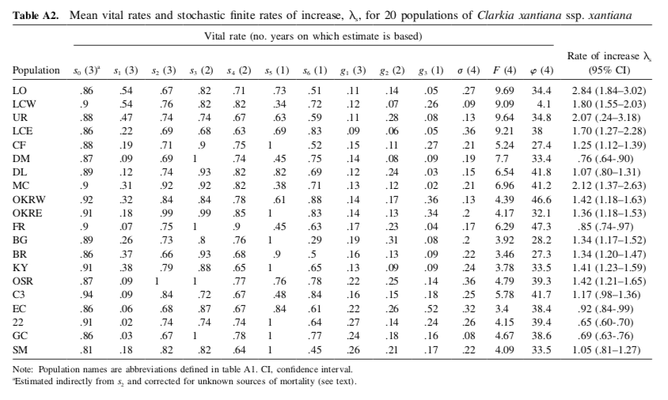
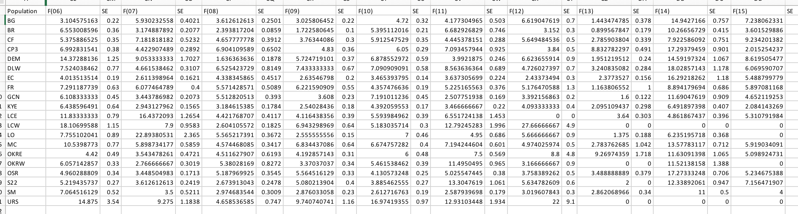

### Measurement questions

Here, I document some questions about the Clarkia demography dataset. I am using the packages `tidyverse` and `readxl` (documentation: https://readxl.tidyverse.org/). 

- [Seedlings and fruiting plant data](#seedlings-and-fruiting-plant-data)
- [Fruits per plant](#fruits-per-plant)
- [Comparison of estimates for F](#comparison-of-estimates-for-f)

### Load packages

Load the libraries for data processing (see https://github.com/r-lib/rlang/issues/669 for the overwrite message I am suppressing)

```{r, message=FALSE, warning=FALSE}
library(tidyverse)
library(knitr)
library(ggplot2)
```

### Seedlings and fruiting plant data

How often are there fewer seedlings counted than fruiting plants, and how might this affect estimates of survival? To address this question, I will explore the distribution of undercounting seedlings. 

```{r, message=FALSE, warning=FALSE}
censusSeedlingsFruitingPlants<-readRDS("~/Dropbox/dataLibrary/postProcessingData/censusSeedlingsFruitingPlants.RDS")

summary <- censusSeedlingsFruitingPlants %>%
  dplyr::mutate(error = ifelse(fruitplNumber>seedlingNumber,1,0)) %>%
  dplyr::filter(!is.na(seedlingNumber)) %>%
  dplyr::summarise(prop = sum(error,na.rm=TRUE)/n())
```

In the observations from 2006-2015, `r summary$prop`% of observations exhibit undercounting (i.e. fewer seedlings in a plot in January/February than fruiting plants in June).

One approach to this would be to assume that the survival in these plots is 100%. This would mean setting the number of seedlings in the plots equal to the number of fruiting plants. I plot how the proportion of plots at a population/year corresponds to the estimate of survival if seedling counts are adjusted to match fruiting plant counts in plots with undercounting. 

```{r, message=FALSE, warning=FALSE}
summary <- censusSeedlingsFruitingPlants %>%
  dplyr::mutate(ratio=fruitplNumber/seedlingNumber) 

# 5% of the dataset has observation errors
summary<-censusSeedlingsFruitingPlants %>%
  dplyr::mutate(error = ifelse(fruitplNumber>seedlingNumber,1,0)) %>%
  dplyr::group_by(site,year,transect) %>%
  dplyr::summarise(prop = sum(error,na.rm=TRUE)/n())

summaryTable<-summary %>%
  dplyr::mutate(error = ifelse(prop>0,1,0))

summary <- censusSeedlingsFruitingPlants %>%
  dplyr::mutate(seedlingNumber = ifelse(seedlingNumber<fruitplNumber,
                                        fruitplNumber,seedlingNumber)) %>%
  dplyr::group_by(site,year) %>%
  dplyr::summarise(y = sum(fruitplNumber,na.rm=TRUE),
                   n = sum(seedlingNumber,na.rm=TRUE)) 

df<-summary %>%
  dplyr::left_join(summaryTable,by=c("site","year")) %>%
  dplyr::mutate(sigma = y/n)

# the approach of setting seedlings = fruiting plants
# means that sites with higher proportion of sites with observation error
# have a higher estimated survival probability
ggplot(df) +
  geom_point(aes(x=prop,y=sigma)) +
  facet_wrap(~site) + 
  ylab("Probability seedling survival to fruiting") +
  xlab("Proportion of plots with undercounting") +
  theme_bw()

```
Another approach would be to discard data from any plots where there are more fruiting plants than seedlings. Broadly, this has the effect of decreasing the estimated probability of survival for plots with higher proportions of undercounting. 

```{r, message=FALSE, warning=FALSE}
summary<-censusSeedlingsFruitingPlants %>%
  dplyr::mutate(error = ifelse(fruitplNumber>seedlingNumber,1,0)) %>%
  dplyr::group_by(site,year) %>%
  dplyr::summarise(prop = sum(error,na.rm=TRUE)/n())

summaryTable<-summary %>%
  dplyr::mutate(error = ifelse(prop>0,1,0))

summary <- censusSeedlingsFruitingPlants %>%
  dplyr::filter(fruitplNumber<=seedlingNumber) %>%
  dplyr::group_by(site,year) %>%
  dplyr::summarise(y = sum(fruitplNumber,na.rm=TRUE),
                   n = sum(seedlingNumber,na.rm=TRUE)) 

df2<-summary %>%
  dplyr::left_join(summaryTable,by=c("site","year"))

# the approach of setting seedlings = fruiting plants
# means that sites with higher proportion of sites with observation error
# have a higher estimated survival probability
ggplot() +
  geom_point(data=df,aes(prop,y/n)) +
    geom_point(data=df2,aes(prop,y/n),col="orange",alpha=.5) +
  facet_wrap(~site)

```
It also seems like there is variation by transect within populations and years. It seems like this might vary by plot along transect; at least for some populations. This makes sense since transects correspond to different parts of the populations. 
```{r, message=FALSE, warning=FALSE}
summary<-censusSeedlingsFruitingPlants %>%
  dplyr::mutate(error = ifelse(fruitplNumber>seedlingNumber,1,0)) %>%
  dplyr::group_by(site,year,transect) %>%
  dplyr::summarise(prop = sum(error,na.rm=TRUE)/n())

summaryTable<-summary %>%
  dplyr::mutate(error = ifelse(prop>0,1,0))

summary <- censusSeedlingsFruitingPlants %>%
  dplyr::mutate(seedlingNumber = ifelse(seedlingNumber<fruitplNumber,
                                        fruitplNumber,seedlingNumber)) %>%
  dplyr::group_by(site,year,transect) %>%
  dplyr::summarise(y = sum(fruitplNumber,na.rm=TRUE),
                   n = sum(seedlingNumber,na.rm=TRUE)) 

df<-summary %>%
  dplyr::left_join(summaryTable,by=c("site","year","transect"))

# the approach of setting seedlings = fruiting plants
# means that sites with higher proportion of sites with observation error
# have a higher estimated survival probability
ggplot(df ) +
  geom_line(aes(transect,prop,group=interaction(year,site),color=as.factor(year))) +
  facet_wrap(~site) + ylab("Proportion of plots with undercounting")
```
Another solution would be to estimate the true number of seedlings using a model for undercounting, and use that true number of seedlings in the model for survival.

### Fruits per plant

Do plants in permanent plots have more fruits than plants outside of permanent plots? I started thinking about this pattern because I wanted to understand seed rain into plots. Permanent plots may be more likely to be surveyed for all plants, while extra plants are counted ad hoc. This sampling method may bias the 'extra plants' towards plants that are larger, have more fruits, or are more visible. A bias in plant size could matter if seed rain is calculated by using the average number of fruits per plant to estimate plant size in a population-year combination. 

I calculated the average number of fruits per plant in permanent plots vs. outside of permanent plots. I did not correct for sampling variation. This first pass suggests that plants outside of permanent plots are, on average, larger than those in permanent plots.

```{r}
countFruitsPerPlantAllPlots <- readRDS("~/Dropbox/dataLibrary/postProcessingData/countFruitsPerPlantAllPlots.RDS")
```

```{r}
ggplot(data=countFruitsPerPlantAllPlots %>% group_by(site,year,permanentPlot) %>% dplyr::summarise(mu=mean(countFruitNumberPerPlant))) +
  geom_point(aes(x=year,y=mu,color=as.factor(permanentPlot)),alpha=.5) +
  geom_line(aes(x=year,y=mu,color=as.factor(permanentPlot)),alpha=.5) +
  facet_wrap(~site,scale='free') +
  ylab("Mean number fruits per plant") +
  theme_bw()
```
Next, I looked to see whether there is a geographic component to this relationship.

```{r, message=FALSE, warning=FALSE}
position<-read.csv(file="~/Dropbox/projects/clarkiaScripts/data/reshapeData/siteAbiotic.csv",header=TRUE) %>% 
  dplyr::select(site,easting) %>%
  dplyr::mutate(easting=easting/1000)

countFruitsPerPlantAllPlotsSummary<-countFruitsPerPlantAllPlots %>%
  dplyr::group_by(site,year,permanentPlot) %>%
  dplyr::summarise(mu = mean(countFruitNumberPerPlant),
                   sd = sd(countFruitNumberPerPlant),
                   n = n(),
                   se = sd/n,
                   p = 1/se) %>%
  dplyr::left_join(position,by="site")
```

I plotted the geographic pattern to estimates from plants in (blue) and outside (pink) of permanent plots. 

```{r, message=FALSE, warning=FALSE}
ggplot(data=countFruitsPerPlantAllPlotsSummary %>% dplyr::filter(year>2006)) +
  geom_point(aes(x=easting,y=mu,color=as.factor(permanentPlot)),alpha=.5) +
  geom_smooth(aes(x=easting,y=mu,color=as.factor(permanentPlot)),method='lm',se=FALSE) +
  facet_wrap(~year,scale='free') +
  theme_bw()
```

I plotted the mean number of fruits per plant vs. easting, with point size corresonding to 1/standard error. Small points have a higher SE; large points have a smaller SE. 

```{r, message=FALSE, warning=FALSE}
ggplot(countFruitsPerPlantAllPlotsSummary %>% dplyr::filter(year>2006)) +
  geom_point(aes(x=easting,y=mu,size=1/se,color=as.factor(permanentPlot)),alpha=.5) +
  facet_wrap(~year) +
  ylab("Mean number of fruits per plant") +
  theme_bw()
```
I looked at how whether the sample size in each category changed geographically.

```{r, message=FALSE, warning=FALSE}
ggplot(countFruitsPerPlantAllPlotsSummary %>% dplyr::filter(year>2006)) +
  geom_point(aes(x=easting,y=n,color=as.factor(permanentPlot))) +
  geom_smooth(aes(x=easting,y=n,color=as.factor(permanentPlot)),method='lm') +
  facet_wrap(~year,scales='free') + 
  ylab("Sample size")
```
I looked at the distribution of the ratio of mean fruits per plant from extra plots vs. permanent plots. The red line corresponds to a 1:1 ratio.

```{r}
test<-countFruitsPerPlantAllPlots %>%
  dplyr::group_by(site,year,permanentPlot)%>%
  dplyr::summarise(mu = mean(countFruitNumberPerPlant)) %>%
  tidyr::pivot_wider(names_from=permanentPlot,values_from=mu) %>%
  dplyr::mutate(ratio = `0`/`1`) 

hist(test$ratio,breaks=100, main = "Distribution of ratio of mean fruits per plant in \n extra plots vs. permanent plots")
abline(v=1,col="red")
```
I looked at the distribution of the ratio of mean fruits per plant from all plots vs. permanent plots only. The red line corresponds to a 1:1 ratio.

```{r, message=FALSE, warning=FALSE}
testAll<-countFruitsPerPlantAllPlots %>%
  dplyr::group_by(site,year)%>%
  dplyr::summarise(mu.all = mean(countFruitNumberPerPlant))

testPermanent<-countFruitsPerPlantAllPlots %>%
  dplyr::filter(permanentPlot==1) %>%
  dplyr::group_by(site,year)%>%
  dplyr::summarise(mu.permanent = mean(countFruitNumberPerPlant))

testComparison <- testAll %>%
  dplyr::left_join(testPermanent,by=c("site","year")) %>%
  dplyr::mutate(ratio = mu.all/mu.permanent) 

hist(testComparison$ratio,breaks=100, main = "Distribution of ratio of mean fruits per plant in \n all plots vs. permanent plots only")
abline(v=1,col="red")

```


### Comparison of estimates for F

I compared the estimates for fruits per plant in the datasets I have to the ones published in the 2011 appendix and the file in the `data and scripts` folder in the Clarkia-LTREB dropbox that summarizes vital rates for a 2017 model. That file is `Clarkia-LTREB\data and scripts\clarkia estimated vital rates and lambdas feb17.xlsx`.

First I calculated the mean fruits per plant in each year-population combination from 2006-2009. I then averaged these values to get a mean value for each population from 2006-2009. I did this because I assumed this is how the values in Table A2 of the appendix for the 2011 Am Nat paper were obtained. Here's the table:


I calculated mean fruits per plant using data from all plots, using data from just the permanent plots, and then added in the data from the table above. The figure below this code chunk compares these 3 estimates. The first column is the estimate from the paper. The second column is the estimate from all plants, the third column is the estimate from the permanent plots. 

```{r}
summaryAllPlants<-countFruitsPerPlantAllPlots %>%
  dplyr::filter(year<2010) %>%
  dplyr::group_by(site,year) %>%
  dplyr::summarise(mu = mean(countFruitNumberPerPlant)) %>%
  dplyr::group_by(site) %>%
  dplyr::summarise(mean.F.allPlants = mean(mu))

summaryPermanentPlotPlants<-countFruitsPerPlantAllPlots %>%
  dplyr::filter(year<2010) %>%
  dplyr::filter(permanentPlot==1) %>%
  dplyr::group_by(site,year) %>%
  dplyr::summarise(mu = mean(countFruitNumberPerPlant)) %>%
  dplyr::group_by(site) %>%
  dplyr::summarise(mean.F.permanentPlotPlants = mean(mu))

sites = 
c("LO","LCW",
  "URS","LCE","CF","DEM","DLW","MC","OKRW","OKRE","FR","BG","BR","KYE","OSR","CP3","EC","S22","GCN","SM")
est = c(9.69,9.09,9.64,9.21,5.24,7.7,6.54,6.96,4.39,4.17,6.29,3.92,3.46,3.78,4.79,5.78,3.4,4.15,4.67,4.09)

app=data.frame(site=sites,mean.F.2011app=est)

summary <- summaryAllPlants %>%
  dplyr::left_join(summaryPermanentPlotPlants,by="site") %>%
  dplyr::left_join(app,by="site")
summary <- summary %>% dplyr::select(site , mean.F.2011app, mean.F.allPlants, mean.F.permanentPlotPlants)
summary[,2:4]<-signif(summary[,2:4],digits=3)

kable(arrange(summary,desc(mean.F.2011app)), caption="Summary table of fruits per plant")
```

Next, I compared the estimates for fruits per plant to the estimates for `F` in `Clarkia-LTREB\data and scripts\clarkia estimated vital rates and lambdas feb17.xlsx`, which has estimates for each vital rate for each year-population combination from 2006-2015. Here's the relevant part of that file:



I calculated mean fruits per plant using data from all plots, using data from just the permanent plots, and then added in the data from the Excel file. The figure below this code chunk compares these 3 estimates. The first column is the estimate from the excel file The second column is the estimate from all plants, the third column is the estimate from the permanent plots. 

```{r}
summaryAllPlants<-countFruitsPerPlantAllPlots %>%
  dplyr::filter(year<2016) %>%
  dplyr::group_by(site,year) %>%
  dplyr::summarise(mean.F.allPlants = mean(countFruitNumberPerPlant))

summaryPermanentPlotPlants<-countFruitsPerPlantAllPlots %>%
  dplyr::filter(year<2016) %>%
  dplyr::filter(permanentPlot==1) %>%
  dplyr::group_by(site,year) %>%
  dplyr::summarise(mean.F.permanentPlotPlants = mean(countFruitNumberPerPlant)) 

df<-readxl::read_excel(path="~/Dropbox/Clarkia-LTREB/data and scripts/clarkia estimated vital rates and lambdas feb17.xlsx")

df<-janitor::clean_names(df,"lower_camel")

df<-df %>%
  dplyr::select(population,contains("f",ignore.case=FALSE)) %>%  tidyr::pivot_longer(cols=contains(c("f")),
               names_to = "variable",
               values_to = "estimate") %>%  
  tidyr::separate(variable,into = c("variable", "year"), "(?<=[a-z])(?=[0-9])") %>%
  dplyr::mutate(year = as.numeric(paste0(20,year))) %>%
  dplyr::select(-variable) %>%
  dplyr::rename(site=population) %>%
  dplyr::filter(!is.na(estimate))

df$year <- as.integer(df$year)

summary <- summaryAllPlants %>%
  dplyr::left_join(df,by=c("site","year")) %>%
  dplyr::left_join(summaryPermanentPlotPlants,by=c("site","year"))

summary <- summary %>% dplyr::select(site, year, estimate, mean.F.allPlants, mean.F.permanentPlotPlants)
summary[,3:5]<-signif(summary[,3:5],digits=3)

kable(arrange(summary), caption="Summary table of fruits per plant")
```
