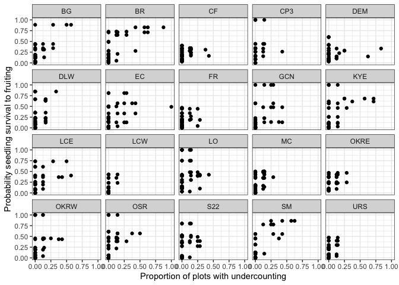
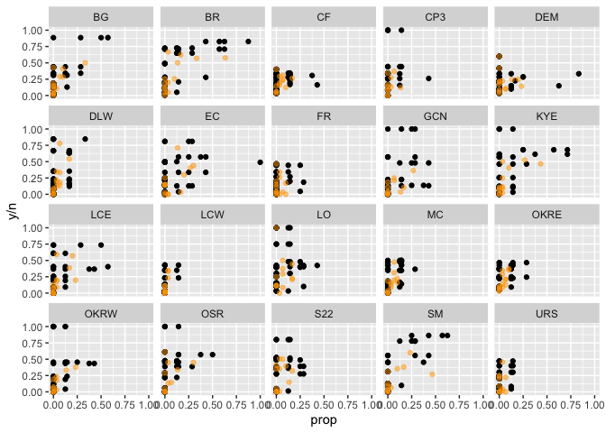
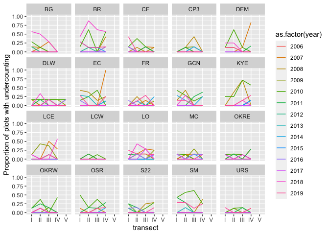
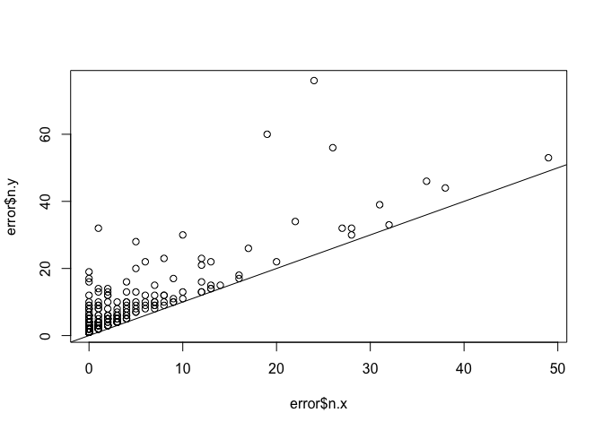
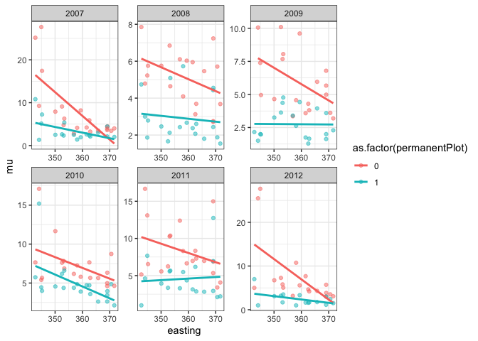
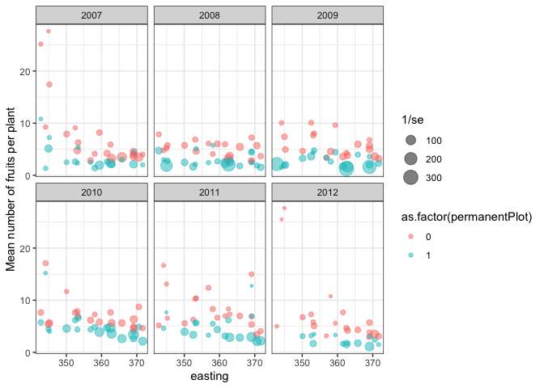
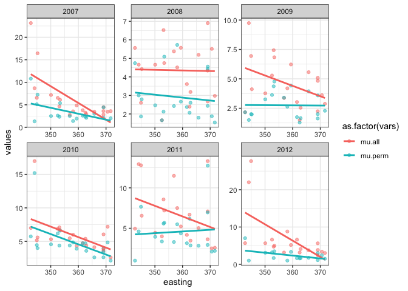
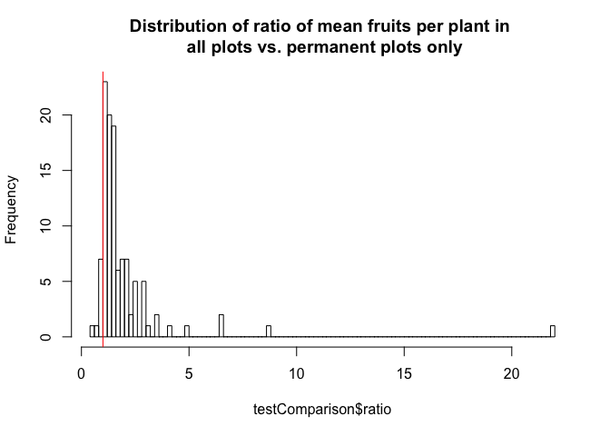

### Measurement issuesd

Here, I document some questions about the Clarkia demography dataset. I
am using the packages `tidyverse` and `readxl` (documentation:
<https://readxl.tidyverse.org/>).

  - [Seedlings and fruiting plant
    data](#seedlings-and-fruiting-plant-data)
  - [Fruits per plant](#fruits-per-plant)
  - [Seed rain and seedlings](#seed-rain-and-seedlings)

### Load packages

Load the libraries for data processing (see
<https://github.com/r-lib/rlang/issues/669> for the overwrite message I
am suppressing)

``` r
library(tidyverse)
library(knitr)
library(ggplot2)
```

### Seedlings and fruiting plant data

How often are there fewer seedlings counted than fruiting plants, and
how might this affect estimates of survival? To address this question, I
will explore the distribution of undercounting seedlings.

``` r
censusSeedlingsFruitingPlants<-readRDS("~/Dropbox/dataLibrary/postProcessingData/censusSeedlingsFruitingPlants.RDS")

summary <- censusSeedlingsFruitingPlants %>%
  dplyr::mutate(error = ifelse(fruitplNumber>seedlingNumber,1,0)) %>%
  dplyr::filter(!is.na(seedlingNumber)) %>%
  dplyr::summarise(prop = sum(error,na.rm=TRUE)/n())
```

In the observations from 2006-2015, `summary$prop`% of observations
exhibit undercounting (i.e. fewer seedlings in a plot in
January/February than fruiting plants in June).

One approach to this would be to assume that the survival in these plots
is 100%. This would mean setting the number of seedlings in the plots
equal to the number of fruiting plants. I plot how the proportion of
plots at a population/year corresponds to the estimate of survival if
seedling counts are adjusted to match fruiting plant counts in plots
with undercounting.

``` r
summary <- censusSeedlingsFruitingPlants %>%
  dplyr::mutate(ratio=fruitplNumber/seedlingNumber) 

# 5% of the dataset has observation errors
summary<-censusSeedlingsFruitingPlants %>%
  dplyr::mutate(error = ifelse(fruitplNumber>seedlingNumber,1,0)) %>%
  dplyr::group_by(site,year,transect) %>%
  dplyr::summarise(prop = sum(error,na.rm=TRUE)/n())

summaryTable<-summary %>%
  dplyr::mutate(error = ifelse(prop>0,1,0))

summary <- censusSeedlingsFruitingPlants %>%
  dplyr::mutate(seedlingNumber = ifelse(seedlingNumber<fruitplNumber,
                                        fruitplNumber,seedlingNumber)) %>%
  dplyr::group_by(site,year) %>%
  dplyr::summarise(y = sum(fruitplNumber,na.rm=TRUE),
                   n = sum(seedlingNumber,na.rm=TRUE)) 

df<-summary %>%
  dplyr::left_join(summaryTable,by=c("site","year")) %>%
  dplyr::mutate(sigma = y/n)

# the approach of setting seedlings = fruiting plants
# means that sites with higher proportion of sites with observation error
# have a higher estimated survival probability
ggplot(df) +
  geom_point(aes(x=prop,y=sigma)) +
  facet_wrap(~site) + 
  ylab("Probability seedling survival to fruiting") +
  xlab("Proportion of plots with undercounting") +
  theme_bw()
```

<!-- -->
Another approach would be to discard data from any plots where there are
more fruiting plants than seedlings. Broadly, this has the effect of
decreasing the estimated probability of survival for plots with higher
proportions of undercounting.

``` r
summary<-censusSeedlingsFruitingPlants %>%
  dplyr::mutate(error = ifelse(fruitplNumber>seedlingNumber,1,0)) %>%
  dplyr::group_by(site,year) %>%
  dplyr::summarise(prop = sum(error,na.rm=TRUE)/n())

summaryTable<-summary %>%
  dplyr::mutate(error = ifelse(prop>0,1,0))

summary <- censusSeedlingsFruitingPlants %>%
  dplyr::filter(fruitplNumber<=seedlingNumber) %>%
  dplyr::group_by(site,year) %>%
  dplyr::summarise(y = sum(fruitplNumber,na.rm=TRUE),
                   n = sum(seedlingNumber,na.rm=TRUE)) 

df2<-summary %>%
  dplyr::left_join(summaryTable,by=c("site","year"))

# the approach of setting seedlings = fruiting plants
# means that sites with higher proportion of sites with observation error
# have a higher estimated survival probability
ggplot() +
  geom_point(data=df,aes(prop,y/n)) +
    geom_point(data=df2,aes(prop,y/n),col="orange",alpha=.5) +
  facet_wrap(~site)
```

<!-- -->
It also seems like there is variation by transect within populations and
years. It seems like this might vary by plot along transect; at least
for some populations. This makes sense since transects correspond to
different parts of the populations.

``` r
summary<-censusSeedlingsFruitingPlants %>%
  dplyr::mutate(error = ifelse(fruitplNumber>seedlingNumber,1,0)) %>%
  dplyr::group_by(site,year,transect) %>%
  dplyr::summarise(prop = sum(error,na.rm=TRUE)/n())

summaryTable<-summary %>%
  dplyr::mutate(error = ifelse(prop>0,1,0))

summary <- censusSeedlingsFruitingPlants %>%
  dplyr::mutate(seedlingNumber = ifelse(seedlingNumber<fruitplNumber,
                                        fruitplNumber,seedlingNumber)) %>%
  dplyr::group_by(site,year,transect) %>%
  dplyr::summarise(y = sum(fruitplNumber,na.rm=TRUE),
                   n = sum(seedlingNumber,na.rm=TRUE)) 

df<-summary %>%
  dplyr::left_join(summaryTable,by=c("site","year","transect"))

# the approach of setting seedlings = fruiting plants
# means that sites with higher proportion of sites with observation error
# have a higher estimated survival probability
ggplot(df ) +
  geom_line(aes(transect,prop,group=interaction(year,site),color=as.factor(year))) +
  facet_wrap(~site) + ylab("Proportion of plots with undercounting")
```

<!-- -->
Another solution would be to estimate the true number of seedlings using
a model for undercounting, and use that true number of seedlings in the
model for survival.

### Fruits per plant

Do plants in permanent plots have more fruits than plants outside of
permanent plots? I started thinking about this pattern because I wanted
to understand seed rain into plots. Permanent plots may be more likely
to be surveyed for all plants, while extra plants are counted ad hoc.
This sampling method may bias the ‘extra plants’ towards plants that are
larger, have more fruits, or are more visible. A bias in plant size
could matter if seed rain is calculated by using the average number of
fruits per plant to estimate plant size in a population-year
combination.

I calculated the average number of fruits per plant in permanent plots
vs. outside of permanent plots. I did not correct for sampling
variation. This first pass suggests that plants outside of permanent
plots are, on average, larger than those in permanent plots.

``` r
countFruitsPerPlantAllPlots <- readRDS("~/Dropbox/dataLibrary/postProcessingData/countFruitsPerPlantAllPlots.RDS")

ggplot(data=countFruitsPerPlantAllPlots %>% group_by(site,year,permanentPlot) %>% dplyr::summarise(mu=mean(countFruitNumberPerPlant))) +
  geom_point(aes(x=year,y=mu,color=as.factor(permanentPlot)),alpha=.5) +
  geom_line(aes(x=year,y=mu,color=as.factor(permanentPlot)),alpha=.5) +
  facet_wrap(~site,scale='free') +
  ylab("Mean number fruits per plant") +
  theme_bw()
```

    ## Warning: Removed 1 rows containing missing values (geom_point).

<!-- -->
Next, I looked to see whether there is a geographic component to this
relationship.

``` r
position<-read.csv(file="~/Dropbox/projects/clarkiaScripts/data/reshapeData/siteAbiotic.csv",header=TRUE) %>% 
  dplyr::select(site,easting) %>%
  dplyr::mutate(easting=easting/1000)

countFruitsPerPlantAllPlotsSummary<-countFruitsPerPlantAllPlots %>%
  dplyr::group_by(site,year,permanentPlot) %>%
  dplyr::summarise(mu = mean(countFruitNumberPerPlant),
                   sd = sd(countFruitNumberPerPlant),
                   n = n(),
                   se = sd/n,
                   p = 1/se) %>%
  dplyr::left_join(position,by="site")
```

I plotted the geographic pattern to estimates from plants in (blue) and
outside (pink) of permanent plots.

``` r
ggplot(data=countFruitsPerPlantAllPlotsSummary %>% dplyr::filter(year>2006)) +
  geom_point(aes(x=easting,y=mu,color=as.factor(permanentPlot)),alpha=.5) +
  geom_smooth(aes(x=easting,y=mu,color=as.factor(permanentPlot)),method='lm',se=FALSE) +
  facet_wrap(~year,scale='free') +
  theme_bw()
```

<!-- -->

I plotted the mean number of fruits per plant vs. easting, with point
size corresonding to 1/standard error. Small points have a higher SE;
large points have a smaller SE.

``` r
ggplot(countFruitsPerPlantAllPlotsSummary %>% dplyr::filter(year>2006)) +
  geom_point(aes(x=easting,y=mu,size=1/se,color=as.factor(permanentPlot)),alpha=.5) +
  facet_wrap(~year) +
  ylab("Mean number of fruits per plant") +
  theme_bw()
```

<!-- -->
I looked at how whether the sample size in each category changed
geographically.

``` r
ggplot(countFruitsPerPlantAllPlotsSummary %>% dplyr::filter(year>2006)) +
  geom_point(aes(x=easting,y=n,color=as.factor(permanentPlot))) +
  geom_smooth(aes(x=easting,y=n,color=as.factor(permanentPlot)),method='lm') +
  facet_wrap(~year,scales='free') + 
  ylab("Sample size")
```

<!-- -->
I looked at the distribution of the ratio of mean fruits per plant from
extra plots vs. permanent plots. The red line corresponds to a 1:1
ratio.

``` r
test<-countFruitsPerPlantAllPlots %>%
  dplyr::group_by(site,year,permanentPlot)%>%
  dplyr::summarise(mu = mean(countFruitNumberPerPlant)) %>%
  tidyr::pivot_wider(names_from=permanentPlot,values_from=mu) %>%
  dplyr::mutate(ratio = `0`/`1`) 

hist(test$ratio,breaks=100, main = "Distribution of ratio of mean fruits per plant in \n extra plots vs. permanent plots")
abline(v=1,col="red")
```

<!-- -->
I looked at the distribution of the ratio of mean fruits per plant from
all plots vs. permanent plots only. The red line corresponds to a 1:1
ratio.

``` r
testAll<-countFruitsPerPlantAllPlots %>%
  dplyr::group_by(site,year)%>%
  dplyr::summarise(mu.all = mean(countFruitNumberPerPlant))

testPermanent<-countFruitsPerPlantAllPlots %>%
  dplyr::filter(permanentPlot==1) %>%
  dplyr::group_by(site,year)%>%
  dplyr::summarise(mu.permanent = mean(countFruitNumberPerPlant))

testComparison <- testAll %>%
  dplyr::left_join(testPermanent,by=c("site","year")) %>%
  dplyr::mutate(ratio = mu.all/mu.permanent) 

hist(testComparison$ratio,breaks=100, main = "Distribution of ratio of mean fruits per plant in \n all plots vs. permanent plots only")
abline(v=1,col="red")
```

<!-- -->
