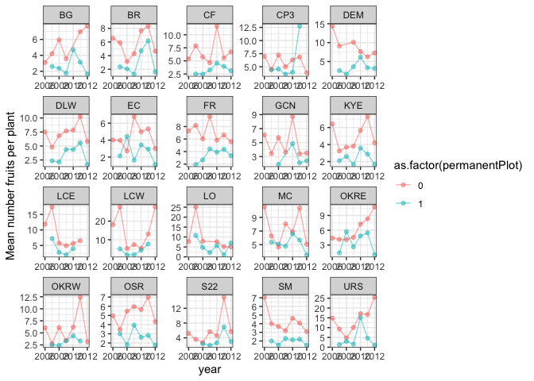
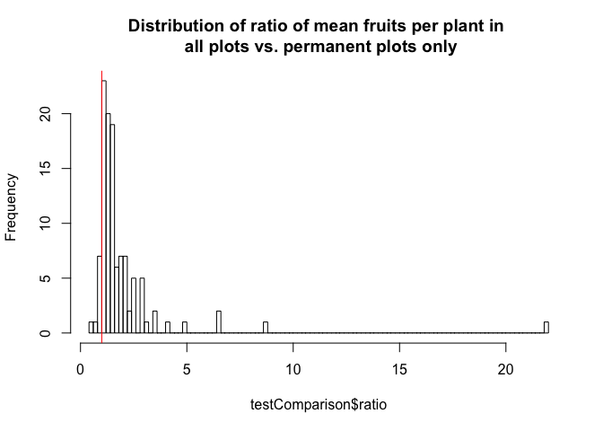

### Measurement questions

Here, I document some questions about the Clarkia demography dataset. I
am using the packages `tidyverse` and `readxl` (documentation:
<https://readxl.tidyverse.org/>).

  - [Seedlings and fruiting plant
    data](#seedlings-and-fruiting-plant-data)
  - [Fruits per plant](#fruits-per-plant)
  - [Comparison of estimates for F](#comparison-of-estimates-for-f)

### Load packages

Load the libraries for data processing (see
<https://github.com/r-lib/rlang/issues/669> for the overwrite message I
am suppressing)

``` r
library(tidyverse)
library(knitr)
library(ggplot2)
```

### Seedlings and fruiting plant data

How often are there fewer seedlings counted than fruiting plants, and
how might this affect estimates of survival? To address this question, I
will explore the distribution of undercounting seedlings.

``` r
censusSeedlingsFruitingPlants<-readRDS("~/Dropbox/dataLibrary/postProcessingData/censusSeedlingsFruitingPlants.RDS")

summary <- censusSeedlingsFruitingPlants %>%
  dplyr::mutate(error = ifelse(fruitplNumber>seedlingNumber,1,0)) %>%
  dplyr::filter(!is.na(seedlingNumber)) %>%
  dplyr::summarise(prop = sum(error,na.rm=TRUE)/n())
```

In the observations from 2006-2015, 0.0489655% of observations exhibit
undercounting (i.e. fewer seedlings in a plot in January/February than
fruiting plants in June).

One approach to this would be to assume that the survival in these plots
is 100%. This would mean setting the number of seedlings in the plots
equal to the number of fruiting plants. I plot how the proportion of
plots at a population/year corresponds to the estimate of survival if
seedling counts are adjusted to match fruiting plant counts in plots
with undercounting.

``` r
summary <- censusSeedlingsFruitingPlants %>%
  dplyr::mutate(ratio=fruitplNumber/seedlingNumber) 

# 5% of the dataset has observation errors
summary<-censusSeedlingsFruitingPlants %>%
  dplyr::mutate(error = ifelse(fruitplNumber>seedlingNumber,1,0)) %>%
  dplyr::group_by(site,year,transect) %>%
  dplyr::summarise(prop = sum(error,na.rm=TRUE)/n())

summaryTable<-summary %>%
  dplyr::mutate(error = ifelse(prop>0,1,0))

summary <- censusSeedlingsFruitingPlants %>%
  dplyr::mutate(seedlingNumber = ifelse(seedlingNumber<fruitplNumber,
                                        fruitplNumber,seedlingNumber)) %>%
  dplyr::group_by(site,year) %>%
  dplyr::summarise(y = sum(fruitplNumber,na.rm=TRUE),
                   n = sum(seedlingNumber,na.rm=TRUE)) 

df<-summary %>%
  dplyr::left_join(summaryTable,by=c("site","year")) %>%
  dplyr::mutate(sigma = y/n)

# the approach of setting seedlings = fruiting plants
# means that sites with higher proportion of sites with observation error
# have a higher estimated survival probability
ggplot(df) +
  geom_point(aes(x=prop,y=sigma)) +
  facet_wrap(~site) + 
  ylab("Probability seedling survival to fruiting") +
  xlab("Proportion of plots with undercounting") +
  theme_bw()
```

<!-- -->
Another approach would be to discard data from any plots where there are
more fruiting plants than seedlings. Broadly, this has the effect of
decreasing the estimated probability of survival for plots with higher
proportions of undercounting.

``` r
summary<-censusSeedlingsFruitingPlants %>%
  dplyr::mutate(error = ifelse(fruitplNumber>seedlingNumber,1,0)) %>%
  dplyr::group_by(site,year) %>%
  dplyr::summarise(prop = sum(error,na.rm=TRUE)/n())

summaryTable<-summary %>%
  dplyr::mutate(error = ifelse(prop>0,1,0))

summary <- censusSeedlingsFruitingPlants %>%
  dplyr::filter(fruitplNumber<=seedlingNumber) %>%
  dplyr::group_by(site,year) %>%
  dplyr::summarise(y = sum(fruitplNumber,na.rm=TRUE),
                   n = sum(seedlingNumber,na.rm=TRUE)) 

df2<-summary %>%
  dplyr::left_join(summaryTable,by=c("site","year"))

# the approach of setting seedlings = fruiting plants
# means that sites with higher proportion of sites with observation error
# have a higher estimated survival probability
ggplot() +
  geom_point(data=df,aes(prop,y/n)) +
    geom_point(data=df2,aes(prop,y/n),col="orange",alpha=.5) +
  facet_wrap(~site)
```

<!-- -->
It also seems like there is variation by transect within populations and
years. It seems like this might vary by plot along transect; at least
for some populations. This makes sense since transects correspond to
different parts of the populations.

``` r
summary<-censusSeedlingsFruitingPlants %>%
  dplyr::mutate(error = ifelse(fruitplNumber>seedlingNumber,1,0)) %>%
  dplyr::group_by(site,year,transect) %>%
  dplyr::summarise(prop = sum(error,na.rm=TRUE)/n())

summaryTable<-summary %>%
  dplyr::mutate(error = ifelse(prop>0,1,0))

summary <- censusSeedlingsFruitingPlants %>%
  dplyr::mutate(seedlingNumber = ifelse(seedlingNumber<fruitplNumber,
                                        fruitplNumber,seedlingNumber)) %>%
  dplyr::group_by(site,year,transect) %>%
  dplyr::summarise(y = sum(fruitplNumber,na.rm=TRUE),
                   n = sum(seedlingNumber,na.rm=TRUE)) 

df<-summary %>%
  dplyr::left_join(summaryTable,by=c("site","year","transect"))

# the approach of setting seedlings = fruiting plants
# means that sites with higher proportion of sites with observation error
# have a higher estimated survival probability
ggplot(df ) +
  geom_line(aes(transect,prop,group=interaction(year,site),color=as.factor(year))) +
  facet_wrap(~site) + ylab("Proportion of plots with undercounting")
```

<!-- -->
Another solution would be to estimate the true number of seedlings using
a model for undercounting, and use that true number of seedlings in the
model for survival.

### Fruits per plant

Do plants in permanent plots have more fruits than plants outside of
permanent plots? I started thinking about this pattern because I wanted
to understand seed rain into plots. Permanent plots may be more likely
to be surveyed for all plants, while extra plants are counted ad hoc.
This sampling method may bias the ‘extra plants’ towards plants that are
larger, have more fruits, or are more visible. A bias in plant size
could matter if seed rain is calculated by using the average number of
fruits per plant to estimate plant size in a population-year
combination.

I calculated the average number of fruits per plant in permanent plots
vs. outside of permanent plots. I did not correct for sampling
variation. This first pass suggests that plants outside of permanent
plots are, on average, larger than those in permanent plots.

``` r
countFruitsPerPlantAllPlots <- readRDS("~/Dropbox/dataLibrary/postProcessingData/countFruitsPerPlantAllPlots.RDS")
```

``` r
ggplot(data=countFruitsPerPlantAllPlots %>% group_by(site,year,permanentPlot) %>% dplyr::summarise(mu=mean(countFruitNumberPerPlant))) +
  geom_point(aes(x=year,y=mu,color=as.factor(permanentPlot)),alpha=.5) +
  geom_line(aes(x=year,y=mu,color=as.factor(permanentPlot)),alpha=.5) +
  facet_wrap(~site,scale='free') +
  ylab("Mean number fruits per plant") +
  theme_bw()
```

    ## Warning: Removed 1 rows containing missing values (geom_point).

<!-- -->
Next, I looked to see whether there is a geographic component to this
relationship.

``` r
position<-read.csv(file="~/Dropbox/projects/clarkiaScripts/data/reshapeData/siteAbiotic.csv",header=TRUE) %>% 
  dplyr::select(site,easting) %>%
  dplyr::mutate(easting=easting/1000)

countFruitsPerPlantAllPlotsSummary<-countFruitsPerPlantAllPlots %>%
  dplyr::group_by(site,year,permanentPlot) %>%
  dplyr::summarise(mu = mean(countFruitNumberPerPlant),
                   sd = sd(countFruitNumberPerPlant),
                   n = n(),
                   se = sd/n,
                   p = 1/se) %>%
  dplyr::left_join(position,by="site")
```

I plotted the geographic pattern to estimates from plants in (blue) and
outside (pink) of permanent plots.

``` r
ggplot(data=countFruitsPerPlantAllPlotsSummary %>% dplyr::filter(year>2006)) +
  geom_point(aes(x=easting,y=mu,color=as.factor(permanentPlot)),alpha=.5) +
  geom_smooth(aes(x=easting,y=mu,color=as.factor(permanentPlot)),method='lm',se=FALSE) +
  facet_wrap(~year,scale='free') +
  theme_bw()
```

<!-- -->

I plotted the mean number of fruits per plant vs. easting, with point
size corresonding to 1/standard error. Small points have a higher SE;
large points have a smaller SE.

``` r
ggplot(countFruitsPerPlantAllPlotsSummary %>% dplyr::filter(year>2006)) +
  geom_point(aes(x=easting,y=mu,size=1/se,color=as.factor(permanentPlot)),alpha=.5) +
  facet_wrap(~year) +
  ylab("Mean number of fruits per plant") +
  theme_bw()
```

<!-- -->
I looked at how whether the sample size in each category changed
geographically.

``` r
ggplot(countFruitsPerPlantAllPlotsSummary %>% dplyr::filter(year>2006)) +
  geom_point(aes(x=easting,y=n,color=as.factor(permanentPlot))) +
  geom_smooth(aes(x=easting,y=n,color=as.factor(permanentPlot)),method='lm') +
  facet_wrap(~year,scales='free') + 
  ylab("Sample size")
```

<!-- -->
I looked at the distribution of the ratio of mean fruits per plant from
extra plots vs. permanent plots. The red line corresponds to a 1:1
ratio.

``` r
test<-countFruitsPerPlantAllPlots %>%
  dplyr::group_by(site,year,permanentPlot)%>%
  dplyr::summarise(mu = mean(countFruitNumberPerPlant)) %>%
  tidyr::pivot_wider(names_from=permanentPlot,values_from=mu) %>%
  dplyr::mutate(ratio = `0`/`1`) 

hist(test$ratio,breaks=100, main = "Distribution of ratio of mean fruits per plant in \n extra plots vs. permanent plots")
abline(v=1,col="red")
```

<!-- -->
I looked at the distribution of the ratio of mean fruits per plant from
all plots vs. permanent plots only. The red line corresponds to a 1:1
ratio.

``` r
testAll<-countFruitsPerPlantAllPlots %>%
  dplyr::group_by(site,year)%>%
  dplyr::summarise(mu.all = mean(countFruitNumberPerPlant))

testPermanent<-countFruitsPerPlantAllPlots %>%
  dplyr::filter(permanentPlot==1) %>%
  dplyr::group_by(site,year)%>%
  dplyr::summarise(mu.permanent = mean(countFruitNumberPerPlant))

testComparison <- testAll %>%
  dplyr::left_join(testPermanent,by=c("site","year")) %>%
  dplyr::mutate(ratio = mu.all/mu.permanent) 

hist(testComparison$ratio,breaks=100, main = "Distribution of ratio of mean fruits per plant in \n all plots vs. permanent plots only")
abline(v=1,col="red")
```

<!-- -->

### Comparison of estimates for F

I compared the estimates for fruits per plant in the datasets I have to
the ones published in the 2011 appendix and the file in the `data and
scripts` folder in the Clarkia-LTREB dropbox that summarizes vital rates
for a 2017 model. That file is `Clarkia-LTREB\data and scripts\clarkia
estimated vital rates and lambdas feb17.xlsx`.

First I calculated the mean fruits per plant in each year-population
combination from 2006-2009. I then averaged these values to get a mean
value for each population from 2006-2009. I did this because I assumed
this is how the values in Table A2 of the appendix for the 2011 Am Nat
paper were obtained. Here’s the table:

 I calculated mean
fruits per plant using data from all plots, using data from just the
permanent plots, and then added in the data from the table above. The
figure below this code chunk compares these 3 estimates. The first
column is the estimate from the paper. The second column is the estimate
from all plants, the third column is the estimate from the permanent
plots.

``` r
summaryAllPlants<-countFruitsPerPlantAllPlots %>%
  dplyr::filter(year<2010) %>%
  dplyr::group_by(site,year) %>%
  dplyr::summarise(mu = mean(countFruitNumberPerPlant)) %>%
  dplyr::group_by(site) %>%
  dplyr::summarise(mean.F.allPlants = mean(mu))

summaryPermanentPlotPlants<-countFruitsPerPlantAllPlots %>%
  dplyr::filter(year<2010) %>%
  dplyr::filter(permanentPlot==1) %>%
  dplyr::group_by(site,year) %>%
  dplyr::summarise(mu = mean(countFruitNumberPerPlant)) %>%
  dplyr::group_by(site) %>%
  dplyr::summarise(mean.F.permanentPlotPlants = mean(mu))

sites = 
c("LO","LCW",
  "URS","LCE","CF","DEM","DLW","MC","OKRW","OKRE","FR","BG","BR","KYE","OSR","CP3","EC","S22","GCN","SM")
est = c(9.69,9.09,9.64,9.21,5.24,7.7,6.54,6.96,4.39,4.17,6.29,3.92,3.46,3.78,4.79,5.78,3.4,4.15,4.67,4.09)

app=data.frame(site=sites,mean.F.2011app=est)

summary <- summaryAllPlants %>%
  dplyr::left_join(summaryPermanentPlotPlants,by="site") %>%
  dplyr::left_join(app,by="site")
```

    ## Warning: Column `site` joining character vector and factor, coercing into
    ## character vector

``` r
summary <- summary %>% dplyr::select(site , mean.F.2011app, mean.F.allPlants, mean.F.permanentPlotPlants)
summary[,2:4]<-signif(summary[,2:4],digits=3)

kable(arrange(summary,desc(mean.F.2011app)), caption="Summary table of fruits per plant")
```

| site | mean.F.2011app | mean.F.allPlants | mean.F.permanentPlotPlants |
| :--- | -------------: | ---------------: | -------------------------: |
| LO   |           9.69 |             9.66 |                       5.90 |
| URS  |           9.64 |             9.49 |                       1.94 |
| LCE  |           9.21 |             9.20 |                       4.00 |
| LCW  |           9.09 |             8.55 |                       3.00 |
| DEM  |           7.70 |             6.96 |                       2.63 |
| MC   |           6.96 |             7.06 |                       5.08 |
| DLW  |           6.54 |             6.54 |                       2.94 |
| FR   |           6.29 |             5.99 |                       3.01 |
| CP3  |           5.78 |             5.80 |                       4.19 |
| CF   |           5.24 |             5.24 |                       2.74 |
| OSR  |           4.79 |             4.79 |                       2.91 |
| GCN  |           4.67 |             4.67 |                       1.88 |
| OKRW |           4.39 |             4.39 |                       2.78 |
| OKRE |           4.17 |             4.17 |                       3.25 |
| S22  |           4.15 |             4.15 |                       2.22 |
| SM   |           4.09 |             4.13 |                       1.94 |
| BG   |           3.92 |             3.38 |                       2.24 |
| KYE  |           3.78 |             3.78 |                       2.12 |
| BR   |           3.46 |             3.42 |                       1.90 |
| EC   |           3.40 |             3.35 |                       2.73 |

Summary table of fruits per plant

Next, I compared the estimates for fruits per plant to the estimates for
`F` in `Clarkia-LTREB\data and scripts\clarkia estimated vital rates and
lambdas feb17.xlsx`, which has estimates for each vital rate for each
year-population combination from 2006-2015. Here’s the relevant part of
that file:


I calculated mean fruits per plant using data from all plots, using data
from just the permanent plots, and then added in the data from the Excel
file. The figure below this code chunk compares these 3 estimates. The
first column is the estimate from the excel file The second column is
the estimate from all plants, the third column is the estimate from the
permanent plots.

``` r
summaryAllPlants<-countFruitsPerPlantAllPlots %>%
  dplyr::filter(year<2016) %>%
  dplyr::group_by(site,year) %>%
  dplyr::summarise(mean.F.allPlants = mean(countFruitNumberPerPlant))

summaryPermanentPlotPlants<-countFruitsPerPlantAllPlots %>%
  dplyr::filter(year<2016) %>%
  dplyr::filter(permanentPlot==1) %>%
  dplyr::group_by(site,year) %>%
  dplyr::summarise(mean.F.permanentPlotPlants = mean(countFruitNumberPerPlant)) 

df<-readxl::read_excel(path="~/Dropbox/Clarkia-LTREB/data and scripts/clarkia estimated vital rates and lambdas feb17.xlsx")
```

    ## New names:
    ## * Lam1 -> Lam1...4
    ## * Lambda_S -> Lambda_S...5
    ## * CL_lo -> CL_lo...7
    ## * CL_up -> CL_up...8
    ## * CL_lo -> CL_lo...10
    ## * … and 95 more problems

``` r
df<-janitor::clean_names(df,"lower_camel")

df<-df %>%
  dplyr::select(population,contains("f",ignore.case=FALSE)) %>%  tidyr::pivot_longer(cols=contains(c("f")),
               names_to = "variable",
               values_to = "estimate") %>%  
  tidyr::separate(variable,into = c("variable", "year"), "(?<=[a-z])(?=[0-9])") %>%
  dplyr::mutate(year = as.numeric(paste0(20,year))) %>%
  dplyr::select(-variable) %>%
  dplyr::rename(site=population) %>%
  dplyr::filter(!is.na(estimate))

df$year <- as.integer(df$year)

summary <- summaryAllPlants %>%
  dplyr::left_join(df,by=c("site","year")) %>%
  dplyr::left_join(summaryPermanentPlotPlants,by=c("site","year"))

summary <- summary %>% dplyr::select(site, year, estimate, mean.F.allPlants, mean.F.permanentPlotPlants)
summary[,3:5]<-signif(summary[,3:5],digits=3)

kable(arrange(summary), caption="Summary table of fruits per plant")
```

| site | year | estimate | mean.F.allPlants | mean.F.permanentPlotPlants |
| :--- | ---: | -------: | ---------------: | -------------------------: |
| BG   | 2006 |     3.10 |             3.10 |                         NA |
| BG   | 2007 |     5.93 |             3.79 |                       2.60 |
| BG   | 2008 |     3.61 |             3.61 |                       2.37 |
| BG   | 2009 |     3.03 |             3.03 |                       1.74 |
| BG   | 2010 |     4.72 |             4.72 |                       4.72 |
| BG   | 2011 |     4.18 |             4.18 |                       3.15 |
| BG   | 2012 |     6.62 |             6.62 |                       1.64 |
| BR   | 2006 |     6.55 |             6.55 |                         NA |
| BR   | 2007 |     3.17 |             3.25 |                       2.35 |
| BR   | 2008 |     2.39 |             2.39 |                       2.07 |
| BR   | 2009 |     1.72 |             1.50 |                       1.29 |
| BR   | 2010 |     5.40 |             5.40 |                       4.70 |
| BR   | 2011 |     6.68 |             6.68 |                       6.18 |
| BR   | 2012 |     3.15 |             3.15 |                       1.59 |
| CF   | 2006 |     5.38 |             5.38 |                         NA |
| CF   | 2007 |     7.18 |             7.18 |                       2.50 |
| CF   | 2008 |     4.66 |             4.66 |                       2.47 |
| CF   | 2009 |     3.76 |             3.76 |                       3.25 |
| CF   | 2010 |     5.91 |             5.32 |                       4.56 |
| CF   | 2011 |     4.45 |             4.45 |                       3.94 |
| CF   | 2012 |     5.65 |             5.65 |                       3.10 |
| CP3  | 2006 |     6.99 |             6.99 |                         NA |
| CP3  | 2007 |     4.42 |             4.48 |                       4.43 |
| CP3  | 2008 |     6.90 |             6.90 |                       4.56 |
| CP3  | 2009 |     4.83 |             4.83 |                       3.59 |
| CP3  | 2010 |     6.05 |             6.05 |                       3.96 |
| CP3  | 2011 |     7.09 |             7.09 |                      12.80 |
| CP3  | 2012 |     3.84 |             3.84 |                         NA |
| DEM  | 2006 |    14.40 |            14.40 |                         NA |
| DEM  | 2007 |     9.05 |             6.53 |                       2.61 |
| DEM  | 2008 |     1.64 |             1.66 |                       1.66 |
| DEM  | 2009 |     5.72 |             5.29 |                       3.63 |
| DEM  | 2010 |     6.88 |             6.88 |                       6.18 |
| DEM  | 2011 |     3.99 |             3.99 |                       3.36 |
| DEM  | 2012 |     6.62 |             6.62 |                       3.20 |
| DLW  | 2006 |     7.52 |             7.52 |                         NA |
| DLW  | 2007 |     4.66 |             4.66 |                       2.33 |
| DLW  | 2008 |     6.53 |             6.53 |                       2.12 |
| DLW  | 2009 |     7.43 |             7.43 |                       4.36 |
| DLW  | 2010 |     7.09 |             7.09 |                       4.38 |
| DLW  | 2011 |     8.56 |             8.56 |                       5.58 |
| DLW  | 2012 |     4.73 |             4.73 |                       1.68 |
| EC   | 2006 |     4.01 |             4.01 |                         NA |
| EC   | 2007 |     2.61 |             2.82 |                       2.12 |
| EC   | 2008 |     4.34 |             4.34 |                       4.43 |
| EC   | 2009 |     2.64 |             2.24 |                       1.63 |
| EC   | 2010 |     3.47 |             3.60 |                       3.44 |
| EC   | 2011 |     3.64 |             3.64 |                       2.94 |
| EC   | 2012 |     2.43 |             2.43 |                       1.12 |
| FR   | 2006 |     7.29 |             7.29 |                         NA |
| FR   | 2007 |     6.08 |             4.86 |                       1.93 |
| FR   | 2008 |     5.57 |             5.57 |                       2.67 |
| FR   | 2009 |     6.22 |             6.22 |                       4.43 |
| FR   | 2010 |     4.36 |             4.36 |                       3.90 |
| FR   | 2011 |     5.23 |             5.23 |                       4.36 |
| FR   | 2012 |     5.18 |             5.18 |                       3.33 |
| GCN  | 2006 |     6.11 |             6.11 |                         NA |
| GCN  | 2007 |     3.44 |             3.44 |                         NA |
| GCN  | 2008 |     5.51 |             5.51 |                       1.88 |
| GCN  | 2009 |     3.61 |             3.61 |                         NA |
| GCN  | 2010 |     7.19 |             7.19 |                       4.85 |
| GCN  | 2011 |     2.51 |             2.51 |                       2.11 |
| GCN  | 2012 |     3.39 |             3.39 |                       2.41 |
| KYE  | 2006 |     6.44 |             6.44 |                         NA |
| KYE  | 2007 |     2.94 |             2.94 |                       2.11 |
| KYE  | 2008 |     3.18 |             3.18 |                       2.60 |
| KYE  | 2009 |     2.54 |             2.54 |                       1.65 |
| KYE  | 2010 |     4.39 |             4.38 |                       3.59 |
| KYE  | 2011 |     3.47 |             3.47 |                       2.88 |
| KYE  | 2012 |     4.09 |             4.09 |                       1.67 |
| LCE  | 2006 |    11.80 |            11.80 |                         NA |
| LCE  | 2007 |    16.40 |            16.40 |                       7.24 |
| LCE  | 2008 |     4.42 |             4.42 |                       2.79 |
| LCE  | 2009 |     4.12 |             4.12 |                       1.98 |
| LCE  | 2010 |     5.59 |             5.59 |                       4.00 |
| LCE  | 2011 |     6.55 |             6.55 |                         NA |
| LCE  | 2012 |     0.00 |               NA |                         NA |
| LCW  | 2006 |    18.10 |            18.10 |                         NA |
| LCW  | 2007 |     7.90 |             6.54 |                       5.13 |
| LCW  | 2008 |     2.60 |             2.60 |                       1.86 |
| LCW  | 2009 |     6.94 |             6.94 |                       2.00 |
| LCW  | 2010 |     5.18 |             5.16 |                       4.45 |
| LCW  | 2011 |    12.80 |            12.80 |                       7.67 |
| LCW  | 2012 |    27.70 |            27.70 |                         NA |
| LO   | 2006 |     7.76 |             7.76 |                         NA |
| LO   | 2007 |    22.90 |            23.10 |                      10.80 |
| LO   | 2008 |     5.57 |             5.57 |                       4.74 |
| LO   | 2009 |     2.56 |             2.16 |                       2.16 |
| LO   | 2010 |     7.00 |             7.00 |                       5.74 |
| LO   | 2011 |     4.95 |             4.95 |                       1.00 |
| LO   | 2012 |     5.67 |             5.67 |                       7.00 |
| MC   | 2006 |    10.50 |            10.50 |                         NA |
| MC   | 2007 |     5.90 |             6.12 |                       5.37 |
| MC   | 2008 |     4.57 |             4.75 |                       5.09 |
| MC   | 2009 |     6.83 |             6.83 |                       4.77 |
| MC   | 2010 |     6.67 |             6.67 |                       6.60 |
| MC   | 2011 |     7.19 |             7.19 |                       5.67 |
| MC   | 2012 |     4.97 |             4.97 |                       3.50 |
| OKRE | 2006 |     4.42 |             4.42 |                         NA |
| OKRE | 2007 |     3.54 |             3.54 |                       1.40 |
| OKRE | 2008 |     4.51 |             4.51 |                       5.73 |
| OKRE | 2009 |     4.19 |             4.19 |                       2.63 |
| OKRE | 2010 |     6.00 |             6.00 |                       4.85 |
| OKRE | 2011 |     7.50 |             7.50 |                       5.49 |
| OKRE | 2012 |     8.80 |             8.80 |                       1.00 |
| OKRW | 2006 |     6.06 |             6.06 |                         NA |
| OKRW | 2007 |     2.77 |             2.77 |                       2.50 |
| OKRW | 2008 |     5.38 |             5.38 |                       2.43 |
| OKRW | 2009 |     3.37 |             3.37 |                       3.40 |
| OKRW | 2010 |     5.46 |             5.46 |                       4.39 |
| OKRW | 2011 |    11.50 |            11.50 |                       3.30 |
| OKRW | 2012 |     3.17 |             3.17 |                         NA |
| OSR  | 2006 |     4.96 |             4.96 |                         NA |
| OSR  | 2007 |     3.45 |             3.45 |                       3.00 |
| OSR  | 2008 |     5.19 |             5.19 |                       1.80 |
| OSR  | 2009 |     5.56 |             5.56 |                       3.94 |
| OSR  | 2010 |     4.13 |             4.13 |                       2.62 |
| OSR  | 2011 |     5.03 |             5.03 |                       2.83 |
| OSR  | 2012 |     3.76 |             3.76 |                       1.75 |
| S22  | 2006 |     5.22 |             5.22 |                         NA |
| S22  | 2007 |     3.61 |             3.61 |                         NA |
| S22  | 2008 |     2.67 |             2.67 |                       2.43 |
| S22  | 2009 |     5.08 |             5.08 |                       2.00 |
| S22  | 2010 |     3.89 |             3.89 |                       2.63 |
| S22  | 2011 |    13.30 |            13.30 |                       6.95 |
| S22  | 2012 |     5.63 |             5.63 |                       3.00 |
| SM   | 2006 |     7.06 |             7.06 |                         NA |
| SM   | 2007 |     3.50 |             3.60 |                       2.00 |
| SM   | 2008 |     2.97 |             2.97 |                       1.54 |
| SM   | 2009 |     2.88 |             2.88 |                       2.29 |
| SM   | 2010 |     2.61 |             2.61 |                       2.14 |
| SM   | 2011 |     2.59 |             2.59 |                       2.20 |
| SM   | 2012 |     3.02 |             3.02 |                       1.50 |
| URS  | 2006 |    14.90 |            14.90 |                         NA |
| URS  | 2007 |     9.28 |             8.70 |                       1.33 |
| URS  | 2008 |     4.66 |             4.66 |                       3.00 |
| URS  | 2009 |     9.74 |             9.74 |                       1.50 |
| URS  | 2010 |    17.00 |            17.00 |                      15.20 |
| URS  | 2011 |    12.90 |            12.90 |                       4.61 |
| URS  | 2012 |    22.00 |            22.00 |                       1.00 |

Summary table of fruits per plant
