### Measurement questions

Here, I document some questions about the Clarkia demography dataset. I
am using the packages `tidyverse` and `readxl` (documentation:
<https://readxl.tidyverse.org/>).

  - [Seedlings and fruiting plant
    data](#seedlings-and-fruiting-plant-data)
  - [Fruits per plant](#fruits-per-plant)
  - [Comparison of estimates for fruits per
    plant](#comparison-of-estimates-for-fruits-per-plant)
  - [Fruits per plant data
    exploration](#fruits-per-plant-data-exploration)
  - [Seedling estimates](#seedling-estimates)

### Load packages

Load the libraries for data processing (see
<https://github.com/r-lib/rlang/issues/669> for the overwrite message I
am suppressing)

``` r
library(tidyverse)
library(knitr)
library(ggplot2)
```

### Seedlings and fruiting plant data

How often are there fewer seedlings counted than fruiting plants, and
how might this affect estimates of survival? To address this question, I
will explore the distribution of undercounting seedlings.

``` r
censusSeedlingsFruitingPlants<-readRDS("~/Dropbox/dataLibrary/postProcessingData/censusSeedlingsFruitingPlants.RDS")

summary <- censusSeedlingsFruitingPlants %>%
  dplyr::mutate(error = ifelse(fruitplNumber>seedlingNumber,1,0)) %>%
  dplyr::filter(!is.na(seedlingNumber)) %>%
  dplyr::summarise(prop = sum(error,na.rm=TRUE)/n())
```

In the observations from 2006-2019, 0.0486585% of observations exhibit
undercounting (i.e. fewer seedlings in a plot in January/February than
fruiting plants in June).

One approach to this would be to assume that the survival in these plots
is 100%. This would mean setting the number of seedlings in the plots
equal to the number of fruiting plants. I plot how the proportion of
plots at a population/year corresponds to the estimate of survival if
seedling counts are set equal to fruiting plant counts in plots with
undercounting.

``` r
summary <- censusSeedlingsFruitingPlants %>%
  dplyr::mutate(ratio=fruitplNumber/seedlingNumber) 

# 5% of the dataset has observation errors
summary<-censusSeedlingsFruitingPlants %>%
  dplyr::mutate(error = ifelse(fruitplNumber>seedlingNumber,1,0)) %>%
  dplyr::group_by(site,year,transect) %>%
  dplyr::summarise(prop = sum(error,na.rm=TRUE)/n())

summaryTable<-summary %>%
  dplyr::mutate(error = ifelse(prop>0,1,0))

summary <- censusSeedlingsFruitingPlants %>%
  dplyr::mutate(seedlingNumber = ifelse(seedlingNumber<fruitplNumber,
                                        fruitplNumber,seedlingNumber)) %>%
  dplyr::group_by(site,year) %>%
  dplyr::summarise(y = sum(fruitplNumber,na.rm=TRUE),
                   n = sum(seedlingNumber,na.rm=TRUE)) 

df<-summary %>%
  dplyr::left_join(summaryTable,by=c("site","year")) %>%
  dplyr::mutate(sigma = y/n)

# the approach of setting seedlings = fruiting plants
# likely means that sites with higher proportion of sites with observation error
# have a higher estimated survival probability
ggplot(df) +
  geom_point(aes(x=prop,y=sigma)) +
  facet_wrap(~site) + 
  ylab("Probability seedling survival to fruiting") +
  xlab("Proportion of plots with undercounting") +
  theme_bw()
```

<!-- -->

Another approach would be to discard data from any plots where there are
more fruiting plants than seedlings. Broadly, this has the effect of
decreasing the estimated probability of survival for plots with higher
proportions of undercounting.

``` r
summary<-censusSeedlingsFruitingPlants %>%
  dplyr::mutate(error = ifelse(fruitplNumber>seedlingNumber,1,0)) %>%
  dplyr::group_by(site,year) %>%
  dplyr::summarise(prop = sum(error,na.rm=TRUE)/n())

summaryTable<-summary %>%
  dplyr::mutate(error = ifelse(prop>0,1,0))

summary <- censusSeedlingsFruitingPlants %>%
  dplyr::filter(fruitplNumber<=seedlingNumber) %>%
  dplyr::group_by(site,year) %>%
  dplyr::summarise(y = sum(fruitplNumber,na.rm=TRUE),
                   n = sum(seedlingNumber,na.rm=TRUE)) 

df2<-summary %>%
  dplyr::left_join(summaryTable,by=c("site","year"))

# the approach of setting seedlings = fruiting plants
# means that sites with higher proportion of sites with observation error
# have a higher estimated survival probability
ggplot() +
  geom_point(data=df,aes(prop,y/n)) +
    geom_point(data=df2,aes(prop,y/n),col="orange",alpha=.5) +
  facet_wrap(~site)
```

<!-- -->

It also seems like there is variation by transect within populations and
years. It seems like this might vary by plot along transect; at least
for some populations. This makes sense since transects correspond to
different parts of the populations.

``` r
summary<-censusSeedlingsFruitingPlants %>%
  dplyr::mutate(error = ifelse(fruitplNumber>seedlingNumber,1,0)) %>%
  dplyr::group_by(site,year,transect) %>%
  dplyr::summarise(prop = sum(error,na.rm=TRUE)/n())

summaryTable<-summary %>%
  dplyr::mutate(error = ifelse(prop>0,1,0))

summary <- censusSeedlingsFruitingPlants %>%
  dplyr::mutate(seedlingNumber = ifelse(seedlingNumber<fruitplNumber,
                                        fruitplNumber,seedlingNumber)) %>%
  dplyr::group_by(site,year,transect) %>%
  dplyr::summarise(y = sum(fruitplNumber,na.rm=TRUE),
                   n = sum(seedlingNumber,na.rm=TRUE)) 

df<-summary %>%
  dplyr::left_join(summaryTable,by=c("site","year","transect"))

# the approach of setting seedlings = fruiting plants
# means that sites with higher proportion of sites with observation error
# have a higher estimated survival probability
ggplot(df ) +
  geom_line(aes(transect,prop,group=interaction(year,site),color=as.factor(year))) +
  facet_wrap(~site) + ylab("Proportion of plots with undercounting")
```

<!-- -->

How much of this is due to sample size? It seems like this is a
reasonable explanation for the discrepancy. Most of the undercounting
happens in plots with few seedlings; the number of fruiting plants tends
to be only slightly higher than the observed number of fruiting plants
and this effect is most pronounced in 2010, 2011, and 2019.

``` r
summaryOriginal <- censusSeedlingsFruitingPlants %>%
  dplyr::mutate(n=seedlingNumber,
                y=fruitplNumber) %>%
  # dplyr::group_by(site,year) %>%
  # dplyr::summarise(n=sum(seedlingNumber,na.rm=TRUE),
  #                  y=sum(fruitplNumber,na.rm=TRUE)) %>%
  dplyr::mutate(p=y/n)

summaryMod <- censusSeedlingsFruitingPlants %>%
  dplyr::mutate(seedlingNumber = ifelse(seedlingNumber<fruitplNumber,
                                        fruitplNumber,seedlingNumber)) %>%
    dplyr::mutate(n=seedlingNumber,
                y=fruitplNumber) %>% 
  # dplyr::group_by(site,year) %>%
  # dplyr::summarise(n=sum(seedlingNumber,na.rm=TRUE),
  #                  y=sum(fruitplNumber,na.rm=TRUE)) %>%
  dplyr::mutate(p.mod=y/n)

df <-summaryOriginal %>%
  dplyr::left_join(summaryMod,c("site","year","transect","position")) %>%
  dplyr::select("site","year","transect","position","n.x","y.x","n.y","y.y","p","p.mod") 

#df[is.na(df$p==df$p.mod),]
#df[df$p==df$p.mod,]
error=df[df$p!=df$p.mod&!is.na(df$p!=df$p.mod),]

as.numeric(names(table(error$n.y-error$n.x)))
```

    ##  [1]  1  2  3  4  5  6  7  8  9 10 11 12 13 15 16 17 19 20 23 30 31 41 52

``` r
table(error$n.y-error$n.x)/sum(table(error$n.y-error$n.x))
```

    ## 
    ##           1           2           3           4           5           6 
    ## 0.493734336 0.172932331 0.100250627 0.067669173 0.025062657 0.027568922 
    ##           7           8           9          10          11          12 
    ## 0.010025063 0.025062657 0.017543860 0.010025063 0.005012531 0.012531328 
    ##          13          15          16          17          19          20 
    ## 0.002506266 0.005012531 0.005012531 0.002506266 0.002506266 0.002506266 
    ##          23          30          31          41          52 
    ## 0.002506266 0.002506266 0.002506266 0.002506266 0.002506266

``` r
cumsum(table(error$n.y-error$n.x)/sum(table(error$n.y-error$n.x)))
```

    ##         1         2         3         4         5         6         7         8 
    ## 0.4937343 0.6666667 0.7669173 0.8345865 0.8596491 0.8872180 0.8972431 0.9223058 
    ##         9        10        11        12        13        15        16        17 
    ## 0.9398496 0.9498747 0.9548872 0.9674185 0.9699248 0.9749373 0.9799499 0.9824561 
    ##        19        20        23        30        31        41        52 
    ## 0.9849624 0.9874687 0.9899749 0.9924812 0.9949875 0.9974937 1.0000000

``` r
plot(error$n.x,error$n.y);abline(a=0,b=1)
```

<!-- -->

``` r
plot(error$n.x,error$n.y-error$n.x)
```

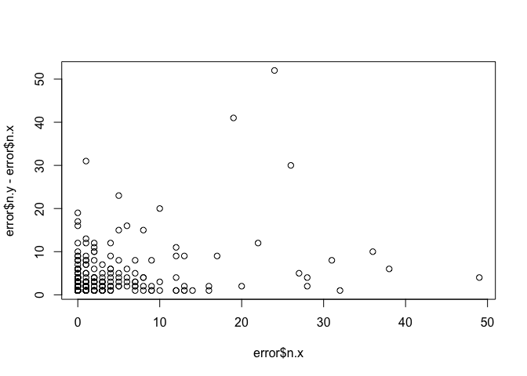<!-- -->

``` r
ggplot(error) +
  geom_point(aes(x=n.x,y=n.y)) +
  facet_wrap(~site) +
  geom_abline(intercept=0,slope=1)
```

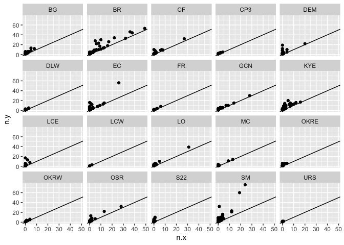<!-- -->

``` r
ggplot(error) +
  geom_point(aes(x=n.x,y=n.y)) +
  facet_wrap(~year) +
  geom_abline(intercept=0,slope=1)
```

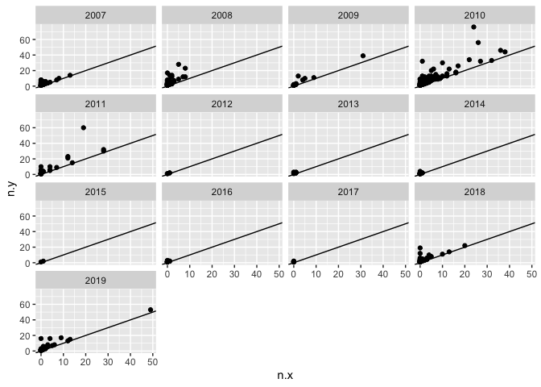<!-- -->

Another solution would be to estimate the true number of seedlings using
a model for undercounting, and use that true number of seedlings in the
model for survival.

### Comparison of estimates for fruits per plant

I compared the estimates for fruits per plant in the datasets I have to
the ones published in the 2011 appendix and the file in the `data and
scripts` folder in the Clarkia-LTREB dropbox that summarizes vital rates
for a 2017 model. That file is `Clarkia-LTREB\data and scripts\clarkia
estimated vital rates and lambdas feb17.xlsx`.

First, I calculated the mean fruits per plant in each year-population
combination from 2006-2009. I then averaged these values to get a mean
value for each population from 2006-2009. I did this because I assumed
this is how the values in Table A2 of the appendix for the 2011 Am Nat
paper were obtained. Here’s the table:

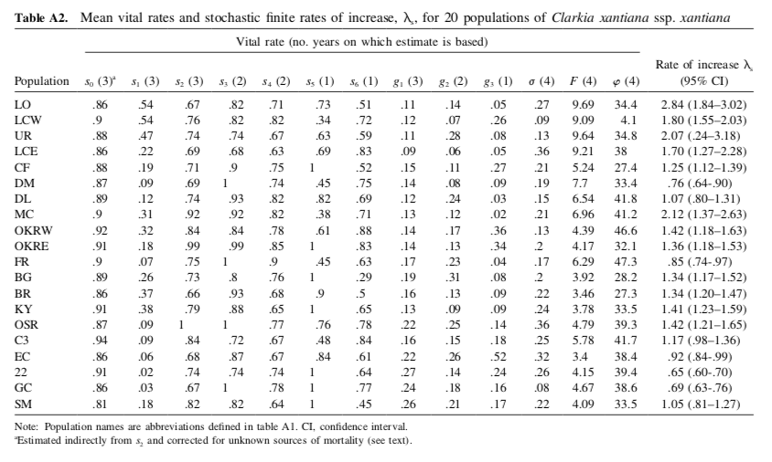 I calculated mean
fruits per plant using data from all plots, using data from just the
permanent plots, and then added in the data from the table above. The
figure below this code chunk compares these 3 estimates. The first
column is the estimate from the paper. The second column is the estimate
from all plants, the third column is the estimate from the permanent
plots.

``` r
countFruitsPerPlantAllPlots <- readRDS("~/Dropbox/dataLibrary/postProcessingData/countFruitsPerPlantAllPlots.RDS")

summaryAllPlants<-countFruitsPerPlantAllPlots %>%
  dplyr::filter(year<2010) %>%
  dplyr::group_by(site,year) %>%
  dplyr::summarise(mu = mean(countFruitNumberPerPlant)) %>%
  dplyr::group_by(site) %>%
  dplyr::summarise(mean.F.allPlants = mean(mu))
```

    ## `summarise()` regrouping output by 'site' (override with `.groups` argument)

    ## `summarise()` ungrouping output (override with `.groups` argument)

``` r
summaryPermanentPlotPlants<-countFruitsPerPlantAllPlots %>%
  dplyr::filter(year<2010) %>%
  dplyr::filter(permanentPlot==1) %>%
  dplyr::group_by(site,year) %>%
  dplyr::summarise(mu = mean(countFruitNumberPerPlant)) %>%
  dplyr::group_by(site) %>%
  dplyr::summarise(mean.F.permanentPlotPlants = mean(mu))
```

    ## `summarise()` regrouping output by 'site' (override with `.groups` argument)
    ## `summarise()` ungrouping output (override with `.groups` argument)

``` r
sites = 
c("LO","LCW",
  "URS","LCE","CF","DEM","DLW","MC","OKRW","OKRE","FR","BG","BR","KYE","OSR","CP3","EC","S22","GCN","SM")
est = c(9.69,9.09,9.64,9.21,5.24,7.7,6.54,6.96,4.39,4.17,6.29,3.92,3.46,3.78,4.79,5.78,3.4,4.15,4.67,4.09)

app=data.frame(site=sites,mean.F.2011app=est)

summary <- summaryAllPlants %>%
  dplyr::left_join(summaryPermanentPlotPlants,by="site") %>%
  dplyr::left_join(app,by="site")
summary <- summary %>% dplyr::select(site , mean.F.2011app, mean.F.allPlants, mean.F.permanentPlotPlants)
summary[,2:4]<-signif(summary[,2:4],digits=3)

kable(arrange(summary,desc(mean.F.2011app)), caption="Summary table of fruits per plant")
```

| site | mean.F.2011app | mean.F.allPlants | mean.F.permanentPlotPlants |
| :--- | -------------: | ---------------: | -------------------------: |
| LO   |           9.69 |             9.66 |                       5.90 |
| URS  |           9.64 |             9.49 |                       1.94 |
| LCE  |           9.21 |             9.20 |                       4.00 |
| LCW  |           9.09 |             8.55 |                       3.00 |
| DEM  |           7.70 |             6.96 |                       2.63 |
| MC   |           6.96 |             7.06 |                       5.08 |
| DLW  |           6.54 |             6.54 |                       2.94 |
| FR   |           6.29 |             5.99 |                       3.01 |
| CP3  |           5.78 |             5.80 |                       4.19 |
| CF   |           5.24 |             5.24 |                       2.74 |
| OSR  |           4.79 |             4.79 |                       2.91 |
| GCN  |           4.67 |             4.67 |                       1.88 |
| OKRW |           4.39 |             4.39 |                       2.78 |
| OKRE |           4.17 |             4.17 |                       3.25 |
| S22  |           4.15 |             4.15 |                       2.22 |
| SM   |           4.09 |             4.13 |                       1.94 |
| BG   |           3.92 |             3.38 |                       2.24 |
| KYE  |           3.78 |             3.78 |                       2.12 |
| BR   |           3.46 |             3.42 |                       1.90 |
| EC   |           3.40 |             3.35 |                       2.73 |

Summary table of fruits per plant

Next, I compared the estimates for fruits per plant to the estimates for
`F` in `Clarkia-LTREB\data and scripts\clarkia estimated vital rates and
lambdas feb17.xlsx`, which has estimates for each vital rate for each
year-population combination from 2006-2015. Here’s the relevant part of
that file:

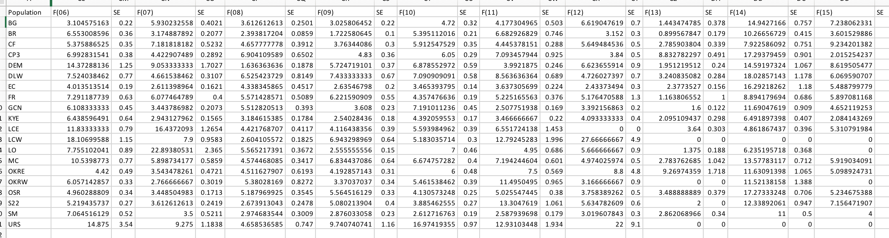

I calculated mean fruits per plant using data from all plots, using data
from just the permanent plots, and then added in the data from the Excel
file. The figure below this code chunk compares these 3 estimates. The
first column is the estimate from the excel file. The second column is
the estimate from all plants, the third column is the estimate from the
permanent plots. Note that there is not estimate of fruits per plant in
permanent plots in the year 2006.

``` r
summaryAllPlants<-countFruitsPerPlantAllPlots %>%
  dplyr::filter(year<2016) %>%
  dplyr::group_by(site,year) %>%
  dplyr::summarise(mean.F.allPlants = mean(countFruitNumberPerPlant))
```

    ## `summarise()` regrouping output by 'site' (override with `.groups` argument)

``` r
summaryPermanentPlotPlants<-countFruitsPerPlantAllPlots %>%
  dplyr::filter(year<2016) %>%
  dplyr::filter(permanentPlot==1) %>%
  dplyr::group_by(site,year) %>%
  dplyr::summarise(mean.F.permanentPlotPlants = mean(countFruitNumberPerPlant)) 
```

    ## `summarise()` regrouping output by 'site' (override with `.groups` argument)

``` r
df<-readxl::read_excel(path="~/Dropbox/Clarkia-LTREB/data and scripts/clarkia estimated vital rates and lambdas feb17.xlsx")
```

    ## New names:
    ## * Lam1 -> Lam1...4
    ## * Lambda_S -> Lambda_S...5
    ## * CL_lo -> CL_lo...7
    ## * CL_up -> CL_up...8
    ## * CL_lo -> CL_lo...10
    ## * ...

``` r
df<-janitor::clean_names(df,"lower_camel")

df<-df %>%
  dplyr::select(population,contains("f",ignore.case=FALSE)) %>%  tidyr::pivot_longer(cols=contains(c("f")),
               names_to = "variable",
               values_to = "estimate") %>%  
  tidyr::separate(variable,into = c("variable", "year"), "(?<=[a-z])(?=[0-9])") %>%
  dplyr::mutate(year = as.numeric(paste0(20,year))) %>%
  dplyr::select(-variable) %>%
  dplyr::rename(site=population) %>%
  dplyr::filter(!is.na(estimate))

df$year <- as.integer(df$year)

summary <- summaryAllPlants %>%
  dplyr::left_join(df,by=c("site","year")) %>%
  dplyr::left_join(summaryPermanentPlotPlants,by=c("site","year"))

summary <- summary %>% dplyr::select(site, year, estimate, mean.F.allPlants, mean.F.permanentPlotPlants)
summary[,3:5]<-signif(summary[,3:5],digits=3)

kable(arrange(summary), caption="Summary table of fruits per plant")
```

| site | year | estimate | mean.F.allPlants | mean.F.permanentPlotPlants |
| :--- | ---: | -------: | ---------------: | -------------------------: |
| BG   | 2006 |     3.10 |             3.10 |                         NA |
| BG   | 2007 |     5.93 |             3.79 |                       2.60 |
| BG   | 2008 |     3.61 |             3.61 |                       2.37 |
| BG   | 2009 |     3.03 |             3.03 |                       1.74 |
| BG   | 2010 |     4.72 |             4.72 |                       4.72 |
| BG   | 2011 |     4.18 |             4.18 |                       3.15 |
| BG   | 2012 |     6.62 |             6.62 |                       1.64 |
| BR   | 2006 |     6.55 |             6.55 |                         NA |
| BR   | 2007 |     3.17 |             3.25 |                       2.35 |
| BR   | 2008 |     2.39 |             2.39 |                       2.07 |
| BR   | 2009 |     1.72 |             1.50 |                       1.29 |
| BR   | 2010 |     5.40 |             5.40 |                       4.70 |
| BR   | 2011 |     6.68 |             6.68 |                       6.18 |
| BR   | 2012 |     3.15 |             3.15 |                       1.59 |
| CF   | 2006 |     5.38 |             5.38 |                         NA |
| CF   | 2007 |     7.18 |             7.18 |                       2.50 |
| CF   | 2008 |     4.66 |             4.66 |                       2.47 |
| CF   | 2009 |     3.76 |             3.76 |                       3.25 |
| CF   | 2010 |     5.91 |             5.32 |                       4.56 |
| CF   | 2011 |     4.45 |             4.45 |                       3.94 |
| CF   | 2012 |     5.65 |             5.65 |                       3.10 |
| CP3  | 2006 |     6.99 |             6.99 |                         NA |
| CP3  | 2007 |     4.42 |             4.48 |                       4.43 |
| CP3  | 2008 |     6.90 |             6.90 |                       4.56 |
| CP3  | 2009 |     4.83 |             4.83 |                       3.59 |
| CP3  | 2010 |     6.05 |             6.05 |                       3.96 |
| CP3  | 2011 |     7.09 |             7.09 |                      12.80 |
| CP3  | 2012 |     3.84 |             3.84 |                         NA |
| DEM  | 2006 |    14.40 |            14.40 |                         NA |
| DEM  | 2007 |     9.05 |             6.53 |                       2.61 |
| DEM  | 2008 |     1.64 |             1.66 |                       1.66 |
| DEM  | 2009 |     5.72 |             5.29 |                       3.63 |
| DEM  | 2010 |     6.88 |             6.88 |                       6.18 |
| DEM  | 2011 |     3.99 |             3.99 |                       3.36 |
| DEM  | 2012 |     6.62 |             6.62 |                       3.20 |
| DLW  | 2006 |     7.52 |             7.52 |                         NA |
| DLW  | 2007 |     4.66 |             4.66 |                       2.33 |
| DLW  | 2008 |     6.53 |             6.53 |                       2.12 |
| DLW  | 2009 |     7.43 |             7.43 |                       4.36 |
| DLW  | 2010 |     7.09 |             7.09 |                       4.38 |
| DLW  | 2011 |     8.56 |             8.56 |                       5.58 |
| DLW  | 2012 |     4.73 |             4.73 |                       1.68 |
| EC   | 2006 |     4.01 |             4.01 |                         NA |
| EC   | 2007 |     2.61 |             2.82 |                       2.12 |
| EC   | 2008 |     4.34 |             4.34 |                       4.43 |
| EC   | 2009 |     2.64 |             2.24 |                       1.63 |
| EC   | 2010 |     3.47 |             3.60 |                       3.44 |
| EC   | 2011 |     3.64 |             3.64 |                       2.94 |
| EC   | 2012 |     2.43 |             2.43 |                       1.12 |
| FR   | 2006 |     7.29 |             7.29 |                         NA |
| FR   | 2007 |     6.08 |             4.86 |                       1.93 |
| FR   | 2008 |     5.57 |             5.57 |                       2.67 |
| FR   | 2009 |     6.22 |             6.22 |                       4.43 |
| FR   | 2010 |     4.36 |             4.36 |                       3.90 |
| FR   | 2011 |     5.23 |             5.23 |                       4.36 |
| FR   | 2012 |     5.18 |             5.18 |                       3.33 |
| GCN  | 2006 |     6.11 |             6.11 |                         NA |
| GCN  | 2007 |     3.44 |             3.44 |                         NA |
| GCN  | 2008 |     5.51 |             5.51 |                       1.88 |
| GCN  | 2009 |     3.61 |             3.61 |                         NA |
| GCN  | 2010 |     7.19 |             7.19 |                       4.85 |
| GCN  | 2011 |     2.51 |             2.51 |                       2.11 |
| GCN  | 2012 |     3.39 |             3.39 |                       2.41 |
| KYE  | 2006 |     6.44 |             6.44 |                         NA |
| KYE  | 2007 |     2.94 |             2.94 |                       2.11 |
| KYE  | 2008 |     3.18 |             3.18 |                       2.60 |
| KYE  | 2009 |     2.54 |             2.54 |                       1.65 |
| KYE  | 2010 |     4.39 |             4.38 |                       3.59 |
| KYE  | 2011 |     3.47 |             3.47 |                       2.88 |
| KYE  | 2012 |     4.09 |             4.09 |                       1.67 |
| LCE  | 2006 |    11.80 |            11.80 |                         NA |
| LCE  | 2007 |    16.40 |            16.40 |                       7.24 |
| LCE  | 2008 |     4.42 |             4.42 |                       2.79 |
| LCE  | 2009 |     4.12 |             4.12 |                       1.98 |
| LCE  | 2010 |     5.59 |             5.59 |                       4.00 |
| LCE  | 2011 |     6.55 |             6.55 |                         NA |
| LCE  | 2012 |     0.00 |               NA |                         NA |
| LCW  | 2006 |    18.10 |            18.10 |                         NA |
| LCW  | 2007 |     7.90 |             6.54 |                       5.13 |
| LCW  | 2008 |     2.60 |             2.60 |                       1.86 |
| LCW  | 2009 |     6.94 |             6.94 |                       2.00 |
| LCW  | 2010 |     5.18 |             5.16 |                       4.45 |
| LCW  | 2011 |    12.80 |            12.80 |                       7.67 |
| LCW  | 2012 |    27.70 |            27.70 |                         NA |
| LO   | 2006 |     7.76 |             7.76 |                         NA |
| LO   | 2007 |    22.90 |            23.10 |                      10.80 |
| LO   | 2008 |     5.57 |             5.57 |                       4.74 |
| LO   | 2009 |     2.56 |             2.16 |                       2.16 |
| LO   | 2010 |     7.00 |             7.00 |                       5.74 |
| LO   | 2011 |     4.95 |             4.95 |                       1.00 |
| LO   | 2012 |     5.67 |             5.67 |                       7.00 |
| MC   | 2006 |    10.50 |            10.50 |                         NA |
| MC   | 2007 |     5.90 |             6.12 |                       5.37 |
| MC   | 2008 |     4.57 |             4.75 |                       5.09 |
| MC   | 2009 |     6.83 |             6.83 |                       4.77 |
| MC   | 2010 |     6.67 |             6.67 |                       6.60 |
| MC   | 2011 |     7.19 |             7.19 |                       5.67 |
| MC   | 2012 |     4.97 |             4.97 |                       3.50 |
| OKRE | 2006 |     4.42 |             4.42 |                         NA |
| OKRE | 2007 |     3.54 |             3.54 |                       1.40 |
| OKRE | 2008 |     4.51 |             4.51 |                       5.73 |
| OKRE | 2009 |     4.19 |             4.19 |                       2.63 |
| OKRE | 2010 |     6.00 |             6.00 |                       4.85 |
| OKRE | 2011 |     7.50 |             7.50 |                       5.49 |
| OKRE | 2012 |     8.80 |             8.80 |                       1.00 |
| OKRW | 2006 |     6.06 |             6.06 |                         NA |
| OKRW | 2007 |     2.77 |             2.77 |                       2.50 |
| OKRW | 2008 |     5.38 |             5.38 |                       2.43 |
| OKRW | 2009 |     3.37 |             3.37 |                       3.40 |
| OKRW | 2010 |     5.46 |             5.46 |                       4.39 |
| OKRW | 2011 |    11.50 |            11.50 |                       3.30 |
| OKRW | 2012 |     3.17 |             3.17 |                         NA |
| OSR  | 2006 |     4.96 |             4.96 |                         NA |
| OSR  | 2007 |     3.45 |             3.45 |                       3.00 |
| OSR  | 2008 |     5.19 |             5.19 |                       1.80 |
| OSR  | 2009 |     5.56 |             5.56 |                       3.94 |
| OSR  | 2010 |     4.13 |             4.13 |                       2.62 |
| OSR  | 2011 |     5.03 |             5.03 |                       2.83 |
| OSR  | 2012 |     3.76 |             3.76 |                       1.75 |
| S22  | 2006 |     5.22 |             5.22 |                         NA |
| S22  | 2007 |     3.61 |             3.61 |                         NA |
| S22  | 2008 |     2.67 |             2.67 |                       2.43 |
| S22  | 2009 |     5.08 |             5.08 |                       2.00 |
| S22  | 2010 |     3.89 |             3.89 |                       2.63 |
| S22  | 2011 |    13.30 |            13.30 |                       6.95 |
| S22  | 2012 |     5.63 |             5.63 |                       3.00 |
| SM   | 2006 |     7.06 |             7.06 |                         NA |
| SM   | 2007 |     3.50 |             3.60 |                       2.00 |
| SM   | 2008 |     2.97 |             2.97 |                       1.54 |
| SM   | 2009 |     2.88 |             2.88 |                       2.29 |
| SM   | 2010 |     2.61 |             2.61 |                       2.14 |
| SM   | 2011 |     2.59 |             2.59 |                       2.20 |
| SM   | 2012 |     3.02 |             3.02 |                       1.50 |
| URS  | 2006 |    14.90 |            14.90 |                         NA |
| URS  | 2007 |     9.28 |             8.70 |                       1.33 |
| URS  | 2008 |     4.66 |             4.66 |                       3.00 |
| URS  | 2009 |     9.74 |             9.74 |                       1.50 |
| URS  | 2010 |    17.00 |            17.00 |                      15.20 |
| URS  | 2011 |    12.90 |            12.90 |                       4.61 |
| URS  | 2012 |    22.00 |            22.00 |                       1.00 |

Summary table of fruits per plant

### Fruits per plant data exploration

Do plants in permanent plots have more fruits than plants outside of
permanent plots? I started thinking about this pattern because I wanted
to understand seed rain into plots. Permanent plots may be more likely
to be surveyed for all plants, while extra plants are counted ad hoc.
This sampling method may bias the ‘extra plants’ towards plants that are
larger, have more fruits, or are more visible. A bias in plant size
could matter if seed rain is calculated by using the average number of
fruits per plant to estimate plant size in a population-year
combination.

I calculated the average number of fruits per plant in permanent plots
vs. outside of permanent plots. I did not correct for sampling
variation. This first pass suggests that plants censused outside of
permanent plots are, on average, larger than those in permanent plots.

``` r
countFruitsPerPlantAllPlots <- readRDS("~/Dropbox/dataLibrary/postProcessingData/countFruitsPerPlantAllPlots.RDS")
```

``` r
ggplot(data=countFruitsPerPlantAllPlots %>% group_by(site,year,permanentPlot) %>% dplyr::summarise(mu=mean(countFruitNumberPerPlant))) +
  geom_point(aes(x=year,y=mu,color=as.factor(permanentPlot)),alpha=.5) +
  geom_line(aes(x=year,y=mu,color=as.factor(permanentPlot)),alpha=.5) +
  facet_wrap(~site,scale='free') +
  ylab("Mean number fruits per plant") +
  theme_bw() +
  theme(legend.position="bottom")
```

    ## `summarise()` regrouping output by 'site', 'year' (override with `.groups` argument)

    ## Warning: Removed 1 rows containing missing values (geom_point).

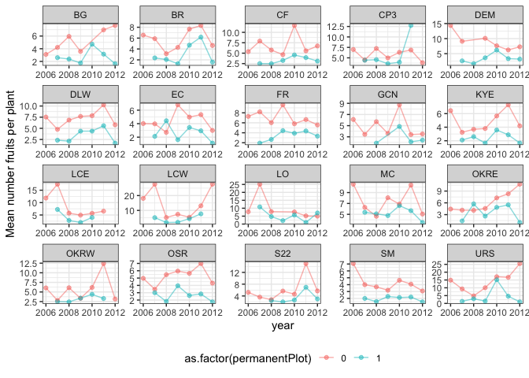<!-- -->

I compared the mean number of fruits per plant for the permanent plot
data versus the permanent plot plus extra throws data. This comparison
is more relevant than the one comparing to permanent vs. non-permanent
plots because this is what is used in the analysis.

``` r
position<-read.csv(file="~/Dropbox/projects/clarkiaScripts/data/reshapeData/siteAbiotic.csv",header=TRUE) %>% 
  dplyr::select(site,easting) %>%
  dplyr::mutate(easting=easting/1000)

countFruitsPerPlantJointSummary<-countFruitsPerPlantAllPlots %>%
  dplyr::group_by(site,year) %>%
  dplyr::summarise(mu.all = mean(countFruitNumberPerPlant)) 

countFruitsPerPlantPermanentSummary<-countFruitsPerPlantAllPlots %>%
  dplyr::filter(permanentPlot==1) %>%
  dplyr::group_by(site,year) %>%
  dplyr::summarise(mu.perm = mean(countFruitNumberPerPlant)) 

countFruitsPerPlantJointSummary<-countFruitsPerPlantJointSummary %>%
  dplyr::left_join(countFruitsPerPlantPermanentSummary,by=c("site","year")) %>%
  tidyr::pivot_longer(cols=c("mu.all","mu.perm"),names_to = "vars",values_to = "values") %>%
  dplyr::left_join(position,by="site")
```

I plotted the geographic pattern to estimates from plants in (blue) and
outside+inside (pink) of permanent plots.

``` r
ggplot(data=countFruitsPerPlantJointSummary %>% dplyr::filter(year>2006)) +
  geom_point(aes(x=easting,y=values,color=as.factor(vars)),alpha=.5) +
  geom_smooth(aes(x=easting,y=values,color=as.factor(vars)),method='lm',se=FALSE) +
  facet_wrap(~year,scale='free') +
  theme_bw()
```

<!-- -->

I hypothesized that the difference in plant size could be the result of
2 different processes. First, the permanent plots might have a different
distribution of fruits per plant than the extra throws. If this were the
case (for example) it might be that the permanent plots have smaller
plants than the extra throws. Second, the permanent plots might have the
same distribution of fruits per plant as the extra throws, but the extra
throws might sample more plants and so have a longer tail. In this case,
extra throws might also include small plants but also sample the large
plant end of the distribution.

To distinguish between these possibilities, I plotted histograms
comparing the distribution of plant size for permanent plots and extra
throws for each site and year combination (see:
fruitsPerPlantComparison.pdf). The plots suggest both patterns. For
example, for Borel Road in 2007, the shape of the distributions support
process 1: counts in the permanent plots captured small plants that were
not counted in the extra throws. Now, for Borel Road in 2012, the shape
of the distributions support process 2: counts in permanent and extra
plots seem to include a similar distribution of plant sizes, but there
are more plants in extra plots and so a longer tail.

``` r
siteNames = unique(countFruitsPerPlantAllPlots$site)
plotList <- list()
for(i in 1:20){
plotList[[i]]<-
  ggplot( ) +
    geom_histogram( data = countFruitsPerPlantAllPlots %>%
  dplyr::filter(year>2006) %>%
  dplyr::filter(site==siteNames[i]) , aes(x=countFruitNumberPerPlant,
              fill=as.factor(permanentPlot)), alpha=.5, position = 'identity',bins=30) +
    scale_fill_manual(values=c("black", "orange")) +
    geom_vline(data = countFruitsPerPlantAllPlots %>%
  dplyr::filter(year>2006) %>%
  dplyr::filter(site==siteNames[i]) %>%
    dplyr::group_by(year,permanentPlot) %>%
    dplyr::summarise(mu = mean(countFruitNumberPerPlant)), aes(xintercept = mu, color = as.factor(permanentPlot))) +
      scale_color_manual(values=c("black", "orange")) +
    labs(fill="") +
    theme_bw() +
  facet_wrap(~year,scales='free') +
  labs(title=siteNames[i])
}
```

    ## `summarise()` regrouping output by 'year' (override with `.groups` argument)
    ## `summarise()` regrouping output by 'year' (override with `.groups` argument)
    ## `summarise()` regrouping output by 'year' (override with `.groups` argument)
    ## `summarise()` regrouping output by 'year' (override with `.groups` argument)
    ## `summarise()` regrouping output by 'year' (override with `.groups` argument)
    ## `summarise()` regrouping output by 'year' (override with `.groups` argument)
    ## `summarise()` regrouping output by 'year' (override with `.groups` argument)
    ## `summarise()` regrouping output by 'year' (override with `.groups` argument)
    ## `summarise()` regrouping output by 'year' (override with `.groups` argument)
    ## `summarise()` regrouping output by 'year' (override with `.groups` argument)
    ## `summarise()` regrouping output by 'year' (override with `.groups` argument)
    ## `summarise()` regrouping output by 'year' (override with `.groups` argument)
    ## `summarise()` regrouping output by 'year' (override with `.groups` argument)
    ## `summarise()` regrouping output by 'year' (override with `.groups` argument)
    ## `summarise()` regrouping output by 'year' (override with `.groups` argument)
    ## `summarise()` regrouping output by 'year' (override with `.groups` argument)
    ## `summarise()` regrouping output by 'year' (override with `.groups` argument)
    ## `summarise()` regrouping output by 'year' (override with `.groups` argument)
    ## `summarise()` regrouping output by 'year' (override with `.groups` argument)
    ## `summarise()` regrouping output by 'year' (override with `.groups` argument)

``` r
pdf("~/Dropbox/clarkiaSeedBanks/products/figures/fruitsPerPlantComparison.pdf")
for(i in 1:20){
  print(plotList[[i]])
}
```

    ## Warning: Removed 1 rows containing non-finite values (stat_bin).

    ## Warning: Removed 1 rows containing missing values (geom_vline).

``` r
dev.off()
```

    ## quartz_off_screen 
    ##                 2

#### Discrepancy all data vs. subset of data

I also looked at the data on fruits per plant in a different way,
plotting just the difference between the full and permanent plot data.

``` r
jointDiscrepancy<-countFruitsPerPlantJointSummary %>%
  tidyr::pivot_wider(names_from=c("vars"),values_from=c("values")) %>%
  dplyr::mutate(delta = `mu.all`-`mu.perm`)

ggplot(data=jointDiscrepancy %>% dplyr::filter(year>2006)) +
  geom_smooth(aes(x=easting,y=delta),method='lm') +
  geom_point(aes(x=easting,y=delta),alpha=.5) +
  facet_wrap(~year,scale='free') +
  theme_bw()
```

    ## `geom_smooth()` using formula 'y ~ x'

    ## Warning: Removed 8 rows containing non-finite values (stat_smooth).

    ## Warning: Removed 8 rows containing missing values (geom_point).

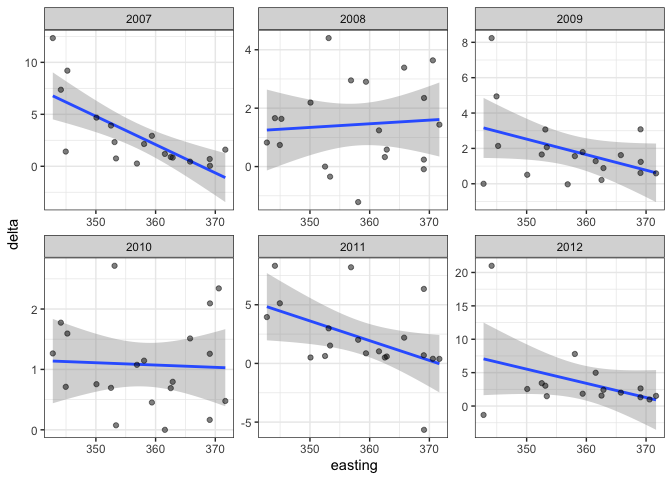<!-- -->

Next, I looked at whether plots with more plants in extra throw plots
vs. permanent plots had a greater difference in plant size. This seems
true in some years but not all.

``` r
countFruitsPerPlantJointNSummary<-countFruitsPerPlantAllPlots %>%
  dplyr::group_by(site,year) %>%
  dplyr::summarise(n.all = n()) 
```

    ## `summarise()` regrouping output by 'site' (override with `.groups` argument)

``` r
countFruitsPerPlantPermanentNSummary<-countFruitsPerPlantAllPlots %>%
  dplyr::filter(permanentPlot==1) %>%
  dplyr::group_by(site,year) %>%
  dplyr::summarise(n.perm =n()) 
```

    ## `summarise()` regrouping output by 'site' (override with `.groups` argument)

``` r
countFruitsPerPlantJointNSummary<-countFruitsPerPlantJointNSummary %>%
  dplyr::left_join(countFruitsPerPlantPermanentNSummary,by=c("site","year")) %>%
  tidyr::pivot_longer(cols=c("n.all","n.perm"),names_to = "vars",values_to = "values") %>%
  dplyr::left_join(position,by="site")

sampleNSummary<-countFruitsPerPlantJointNSummary %>%
  dplyr::filter(year>2006) %>%
  tidyr::pivot_wider(names_from=c("vars"),values_from=c("values")) %>%
  dplyr::mutate(nDelta = `n.all`-`n.perm`)

comparisonN<-jointDiscrepancy %>%
  dplyr::left_join(sampleNSummary,by=c("site","year","easting"))

ggplot(data=comparisonN %>% dplyr::filter(year>2006)) +
    geom_hline(yintercept=0) +
    geom_vline(xintercept=0) +
  geom_smooth(aes(x=nDelta,y=delta),method='lm') +
  geom_point(aes(x=nDelta,y=delta),alpha=.5) +
  facet_wrap(~year,scale='free') +
  theme_bw()
```

    ## `geom_smooth()` using formula 'y ~ x'

    ## Warning: Removed 8 rows containing non-finite values (stat_smooth).

    ## Warning: Removed 8 rows containing missing values (geom_point).

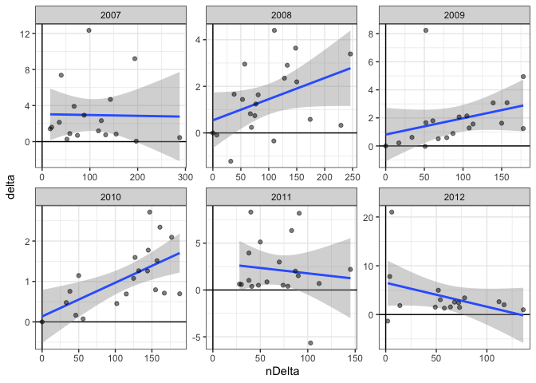<!-- -->

I then looked at whether some sites had greater difference in plant size
when extra throw plots had more plants.

``` r
ggplot(data=comparisonN %>% dplyr::filter(year>2006)) +
  geom_smooth(aes(x=nDelta,y=delta),method='lm') +
  geom_point(aes(x=nDelta,y=delta),alpha=.5) +
  facet_wrap(~site,scale='free') +
  theme_bw() +
    geom_hline(yintercept=0) +
    geom_vline(xintercept=0) 
```

    ## `geom_smooth()` using formula 'y ~ x'

    ## Warning: Removed 8 rows containing non-finite values (stat_smooth).

    ## Warning: Removed 8 rows containing missing values (geom_point).

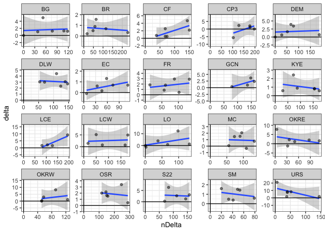<!-- -->

Here we see that generally when there are more extra plots the
discrepancy between permanent plot plant size and all plot plant size
grows.

#### Area and discrepancy

I evaluated the hypothesis that the difference would be greatest at
sites where the permanent plots cover less of the population. This does
not seem to be the case. Instead, there doesn’t seem to be a
relationship between proportion of the plot covered by permanent plots
and the difference.

First, I load in the site abiotic data and calculate the proportion of
the site that is covered by the permanent plots. The area data is in
hectares (1 ha = 10000 meters squared). There are 30 1$$0.5 meter plots
at each site.

``` r
siteAbioticData <- readRDS("~/Dropbox/dataLibrary/postProcessingData/siteAbioticData.RDS")

plotProp = siteAbioticData %>%
  dplyr::select(site,area,easting) %>%
  dplyr::mutate(areaMeters = area*10000) %>%
  dplyr::mutate(plotsProportion = (30*.5)/areaMeters)
```

I then calculated the difference between the average size of plants
outside of permanent plots vs. the average size of plants in permanent
plots (`delta`).

``` r
countFruitsPerPlantAllPlotsSummary<-countFruitsPerPlantAllPlots %>%
  dplyr::group_by(site,year,permanentPlot) %>%
  dplyr::summarise(mu = mean(countFruitNumberPerPlant),
                   sd = sd(countFruitNumberPerPlant),
                   n = n(),
                   se = sd/n,
                   p = 1/se) %>%
  dplyr::left_join(plotProp,by="site")
```

    ## `summarise()` regrouping output by 'site', 'year' (override with `.groups` argument)

``` r
deltaSummary<-countFruitsPerPlantAllPlotsSummary %>%
  dplyr::filter(year>2006) %>%
  dplyr::select(-c(sd,n,se,p)) %>%
  tidyr::pivot_wider(names_from=c("permanentPlot"),values_from=c("mu")) %>%
  dplyr::mutate(delta = `0`-`1`)
```

I hypothesized that there might be a bigger difference between the size
of plants in/out of permanent plots at sites where the permanent plots
were a smaller fraction of the total site area. Plotting the difference
in mean plant size against the proportion of the site taken up by
permanent plots, I expected I might find a negative relationship between
the difference and proportion of the site taken up by the plots. I did
not find this relationship.

``` r
ggplot(data=deltaSummary) +
  geom_smooth(aes(x=plotsProportion,y=delta),method='lm') +
  geom_point(aes(x=plotsProportion,y=delta),alpha=.5) +
  facet_wrap(~year) +
  ylab("Mean fruits per plant in extra throws \n minus mean fruits per plant in permanent plots") +
  xlab("Proportion of site covered by permanent plots")+
  theme_bw()
```

    ## `geom_smooth()` using formula 'y ~ x'

    ## Warning: Removed 11 rows containing non-finite values (stat_smooth).

    ## Warning: Removed 11 rows containing missing values (geom_point).

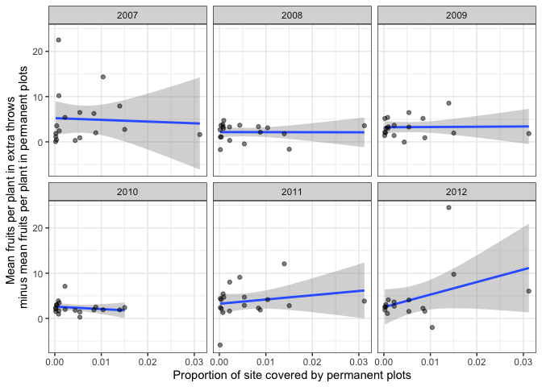<!-- -->

Here is the discrepancy plotted against easting:

``` r
ggplot(data=deltaSummary) +
  geom_smooth(aes(x=easting,y=delta),method='lm') +
  geom_point(aes(x=easting,y=delta),alpha=.5) +
  facet_wrap(~year,scale='free') +
  theme_bw()
```

    ## `geom_smooth()` using formula 'y ~ x'

    ## Warning: Removed 11 rows containing non-finite values (stat_smooth).

    ## Warning: Removed 11 rows containing missing values (geom_point).

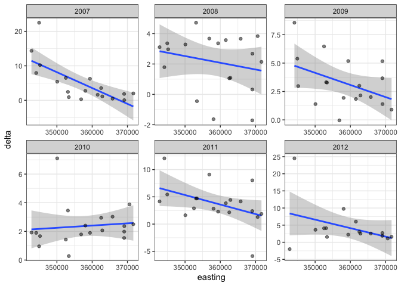<!-- -->

Next, I compared the difference in sample size between permanent and
extra plots. I took the difference of the number of extra plots and
permanent plots. Positive values indicate there were more extra plots.
Negative values indicate there were more permanent plots.

I hypothesized that site-year combinations with greater differences in
sample size of permanent vs. extra plots might have greater differences
in plant size. This doesn’t seem to be uniformly true.

``` r
sampleSummary<-countFruitsPerPlantAllPlotsSummary %>%
  dplyr::filter(year>2006) %>%
  dplyr::select(-c(sd,mu,se,p)) %>%
  tidyr::pivot_wider(names_from=c("permanentPlot"),values_from=c("n")) %>%
  dplyr::mutate(nDelta = `0`-`1`)

comparison<-deltaSummary %>%
  dplyr::left_join(sampleSummary,by=c("site","year","area","easting","areaMeters","plotsProportion"))

ggplot(data=comparison) +
    geom_hline(yintercept=0) +
    geom_vline(xintercept=0) +
  geom_smooth(aes(x=nDelta,y=delta),method='lm') +
  geom_point(aes(x=nDelta,y=delta),alpha=.5) +
  facet_wrap(~year,scale='free') +
  theme_bw()
```

    ## `geom_smooth()` using formula 'y ~ x'

    ## Warning: Removed 11 rows containing non-finite values (stat_smooth).

    ## Warning: Removed 11 rows containing missing values (geom_point).

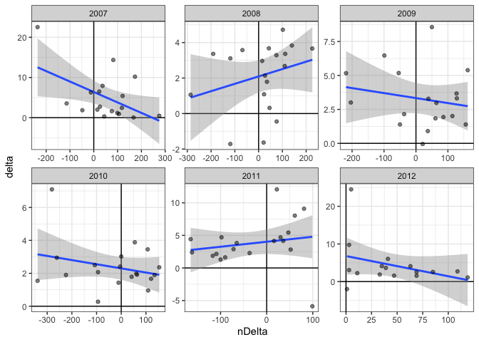<!-- -->

There is no obvious geographic pattern to difference in sample size
either.

``` r
ggplot(data=comparison) +
  geom_smooth(aes(x=easting,y=nDelta),method='lm') +
  geom_point(aes(x=easting,y=nDelta),alpha=.5) +
  facet_wrap(~year,scale='free') +
  theme_bw()
```

    ## `geom_smooth()` using formula 'y ~ x'

    ## Warning: Removed 11 rows containing non-finite values (stat_smooth).

    ## Warning: Removed 11 rows containing missing values (geom_point).

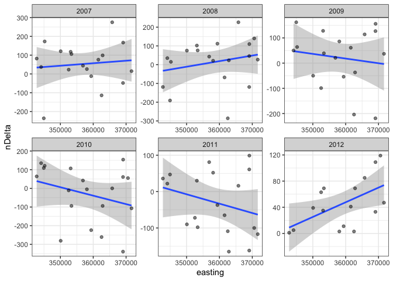<!-- -->
