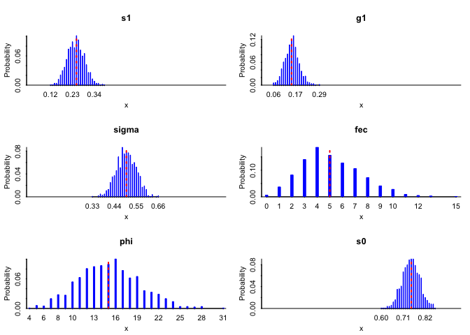

### Packages

I am using the packages `tidyverse` and `readxl` (documentation:
<https://readxl.tidyverse.org/>).

Load the libraries for data processing (see
<https://github.com/r-lib/rlang/issues/669> for the overwrite message I
am suppressing).

``` r
library(tidyverse)
```

    ## ── Attaching packages ──────────────────────────────────────────────────────────────────────────────────────────────────────────── tidyverse 1.3.0 ──

    ## ✓ ggplot2 3.2.1     ✓ purrr   0.3.3
    ## ✓ tibble  2.1.3     ✓ dplyr   0.8.4
    ## ✓ tidyr   1.0.2     ✓ stringr 1.4.0
    ## ✓ readr   1.3.1     ✓ forcats 0.4.0

    ## ── Conflicts ─────────────────────────────────────────────────────────────────────────────────────────────────────────────── tidyverse_conflicts() ──
    ## x dplyr::filter() masks stats::filter()
    ## x dplyr::lag()    masks stats::lag()

``` r
library(knitr)
library(ggplot2)
```

For model building I am using:

``` r
library(rjags)
```

    ## Loading required package: coda

    ## Linked to JAGS 4.3.0

    ## Loaded modules: basemod,bugs

``` r
library(tidybayes)
library(MCMCvis)
```

### Basic model

$ N(t+1) = A N(t) $

where

$ A = s\_1g\_1 F s\_0 $

### Simulate data

Start with a set of mean values that projecs a population growth rate
just above 1.

``` r
s1 = .25;
g1 = 0.15;
sigma = .5;
fec = 5;
phi = 15;
s0 = .75;

vitalRates = c(s1,g1,sigma,fec,phi,s0)
A = prod(vitalRates)
A
```

    ## [1] 1.054688

I start with a data set with many samples per vital rate.

``` r
N = 1000

samples = list()

samples[[1]] = rbinom(n=N,size=100,prob=s1)
samples[[2]] = rbinom(n=N,size=100,prob=g1)
samples[[3]] = rbinom(n=N,size=100,prob=sigma)
samples[[4]] = rnbinom(n=N,size=100,mu = fec)
samples[[5]] = rnbinom(n=N,size=100,mu = phi)
samples[[6]] = rbinom(n=N,size=100,prob=s0)

names(samples) = c("s1","g1","sigma","fec","phi","s0")
```

Plot samples.

``` r
par(mfrow=c(3,2))

arm::discrete.histogram(samples$s1/100,xlim=c(0,1),main="s1");abline(v=s1,col='red',lwd=2,lty='dotted')

arm::discrete.histogram(samples$g1/100,xlim=c(0,1),main="g1");abline(v=g1,col='red',lwd=2,lty='dotted')

arm::discrete.histogram(samples$sigma/100,xlim=c(0,1),main="sigma");abline(v=sigma,col='red',lwd=2,lty='dotted')

arm::discrete.histogram(samples$fec,main="fec");abline(v=fec,col='red',lwd=2,lty='dotted')

arm::discrete.histogram(samples$phi,main="phi");abline(v=phi,col='red',lwd=2,lty='dotted')

arm::discrete.histogram(samples$s0/100,xlim=c(0,1),main="s0");abline(v=s0,col='red',lwd=2,lty='dotted')
```

<!-- -->

## Resample
